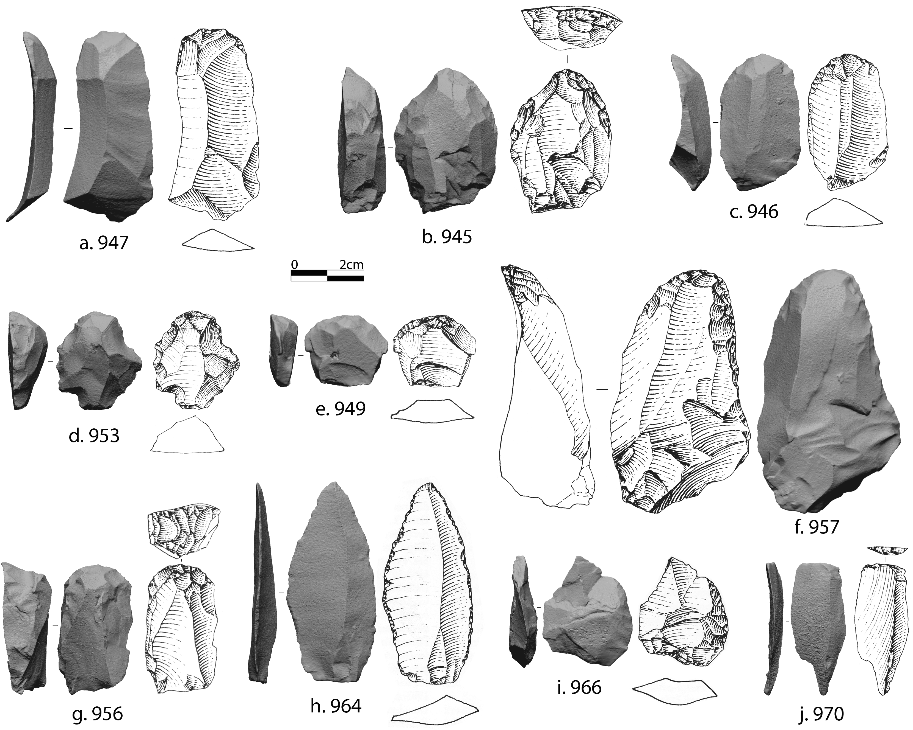

```{r setup, include=FALSE}
knitr::opts_chunk$set(echo = TRUE)
```
```{r include=FALSE}
library(readxl)
library(knitr)
library(kableExtra)
library(dplyr)
library(tidyr)
library(janitor)
library(tidyverse)
library(cowplot)
library(MetBrewer)
library(ggpubr)
library(rstatix)
library(forcats)

Dataset <- read.csv("../data/CTC_Dataset_complete.csv")
Dataset_cores <- read.csv("../data/CTC_Dataset_cores.csv")

comparison <- list(c("ars", "gic"), c("ars", "rsa'"), c("gic", "rsa'"))
comparison_no_ars <- list(c("rsa'", "gic"))
```

```{r, echo=FALSE, include=FALSE, warning=FALSE}
cores_laminar <- Dataset_cores %>%
  filter(Laminar_y_n == "TRUE",
         Core_classification_2 != "Shatter")
```

<br>

# The site
## Grotta di Castelcivita and the Aurignacian stratigraphic sequence
Grotta di Castelcivita (hereafter Castelcivita; Salerno, Campania, Southern Italy) is a cave site situated at an elevation of 94 meters above sea level, nestled at the base of the Alburni massif, near the right bank of the Calore River (40.49563600N, 015.20922177E; see Fig. 1). This cave is part of a karst system that spans two primary levels, comprising an extensive network of tunnels and chambers, with a total length exceeding 5 kilometers (Cafaro et al., 2016). Systematic excavations were first conducted from 1975 to 1988, led by P. Gambassini of the Research Unit of Prehistory and Anthropology at the University of Siena (Gambassini, 1997). Subsequently, fieldwork was resumed in 2015 by the same research unit, under the direction of A. Ronchitelli and A. Moroni, and continuing to the present year, in collaboration with the “Soprintendenza Archeologia, Belle Arti e Paesaggio per le province di Salerno e Avellino”.

The archaeological deposit is situated at the actual cave entrance and presently covers an excavated area of 35 square meters, of which Gambassini excavated 14 in the last century. Before the systematic investigations in 1975, nearly 6 square meters were excavated by looters (see Fig. 3b–d), leaving a deep large pit down to the base of the anthropogenic sequence. The destination of the archaeological materials originating from this area is presently unknown. The archaeological sequence spans a depth of 3.4 meters and contains multiple layers attributed to the late Mousterian (*cgr*, *gar*, lower-*rsi*), the Uluzzian (upper-*rsi*, *pie*, *rpi*, and *rsa’'*), and the Aurignacian (*rsa’*, *gic*, and *ars*; see Fig. 3a). Layer *ars* is overlaid by a decimeter-thick layer of tephra (Giaccio et al., 2008), that corresponds to the well-known Campanian Ignimbrite (CI; Fedele et al., 2004), one of the largest Late Quaternary explosive events and an example of super-eruption (Sparks et al., 2005). This event was recently dated to 39.85 ± 0.14 ka BP (Giaccio et al., 2017) and originated from the largest eruption of the Phlegrean Field caldera. Fallout deposits connected with this event were recognized in many continental, marine, and cave successions of Europe and Asia and, consequently, it is one of the most important temporal and stratigraphic markers of western Eurasia (d'Errico & Banks, 2015). This tephra layer in the succession of Castelcivita represents a *terminus ante quem* for the site’s last human occupations. Layer *CI* is in turn overlaid by a multi-layered flowstone with embedded thin layers of volcanic ashes that seal the entire stratigraphic sequence. These thin layers were probably connected to the surficial reworking of CI deposits, subsequently redeposited within the cave.

In this paper, our focus lies on the Aurignacian sequence, which follows the last Uluzzian layer *rsa’’*, dated to 41.9–40.6 ky cal BP (Douka et al., 2014; Wood et al., 2012). The Aurignacian cultural sequence is thus well-constrained chronologically between the last Uluzzian and the CI (39.85 ± 0.14 ka BP). This suggests that layers *rsa’*–*ars* accumulated over a relatively short period, likely just a few centuries (Giaccio et al., 2008). Castelcivita is, therefore, together with Grotta Paglicci in Gargano (Palma di Cesnola, 2004), a unique case study to investigate the initial stages and early development of the Aurignacian in southern Italy.

The stratigraphic succession of Castelcivita was further revisited in 2020 by I. Martini, adopting a facies analysis-based approach. Layer *rsa’* is made of fine-grained reddish sediments dominated by silt and sand with scattered small limestone debris (2-4 cm in size). The limestone debris results from the cave’s roof degradation, while the sandy sediments are linked to infiltration processes (sensu Martini et al., 2018; Martini et al., 2021) from the outer area. This layer is 12–15 cm thick and, generally, in direct continuity with the Uluzzian from layer *rsa’’*, except for a few discontinuous thin sterile sandy lenses, separating the two levels in some areas. The subsequent layer, *gic*, has a thickness of around 20 cm and is well distinguishable from *rsa’* due to its yellowish color and the presence of extensive concretions. Finally, layer *ars* was excavated over a very limited area because the upper sequence was almost completely disrupted during the construction of an artificial entrance for visitor access to the cave. The sediment composition is similar to that of *rsa’*, primarily sandy but with a lighter color (i.e., orange).

The excavations revealed a few features across the Aurignacian sequence. In the area excavated by Gambassini, a part of an extended surface with fire was identified at the base of layer *gic*, in square H14 between 80 and 90 cm deep. The remaining portion of this surface was brought to light in 2016 in square H15, thus attesting to the presence of a large or two smaller adjacent fireplaces (Supplementary Fig. S1). The fireplace/s, around 2x1 m in total, was/were composed of a layer of ash (above) and a layer of charcoal (below) and was/were lying directly on the surface of the ground, partially in contact with the underlying layer rsa’. Gambassini's excavations did not report any traces of fireplaces in layer *rsa’*, except for a cluster of charcoal found in square H13. However, recent investigations have also revealed similar features to *gic* in this layer.

The excavations conducted between 1975 and 1988 employed a stratigraphic method. Findings were meticulously documented using a grid coordinate system, which consisted of square meters further subdivided into 50x50 cm sectors. Layers were systematically excavated using 10 cm deep spits, further divided into 5 cm sub-spits. Excavators paid close attention to identified discontinuities within each spit, allowing them to follow sloping deposits and anthropogenic features accurately. All archaeological findings were precisely assigned to a specific square, sector, layer, and sub-spit. Furthermore, a significant portion of the materials were spatially documented in three dimensions using elevation (Z) coordinates. All sediments were carefully dried sieved and subsequently subjected to wet sieving with a 1 mm mesh. Further screening was then performed to isolate and categorize all finds.

```{r, echo=FALSE, warning=FALSE, fig.align='center', out.width="80%"}

```
  **Figure S1.** Plan view of the excavation of layer *gic* (spit 8) depicting evidence of the large anthropogenic feature/s (in black) identified in squares H14 and H15. The other excavated squares are colored yellow. Please, refer to the provided legend for interpreting the drawing.

<br>

## The environmental and ecological setting
The environmental and ecological setting of Castelcivita was comprehensively examined by studying large and small mammals, avifauna, ichtyofauna, anthracological remains, and the sedimentary composition of the sequence (see papers in Gambassini, 1997). The evidence gathered highlights significant changes during the transition from *rsa’* to *gic*. Layer *rsa’* contains a fauna assemblage that is notably similar to the last Uluzzian of layer *rsa’’*, marked by the predominance of horses and a significant presence of *Microtus arvalis/agrestis* and *Microtus (Terricola) savii*. Even if rare, taxa related to milder or more humid conditions are still present (e.g. fallow deer, *Apodemus* sp. or *Eliomys* sp.). The avifauna, on the other hand, is characterized by a high frequency of steppe grassland species, particularly those associated with rocky environments. These findings, alongside the sedimentary composition of the layer, collectively suggest relatively cold and arid conditions, featuring open environments with sparse woodlands. Climatic features do not look to be extreme, as indicated by the presence of taxa more related to Mediterranean conditions. In layer *gic*, there is a discernible shift in climate towards a more humid, cold-temperate environment. This is accompanied by a reduction in the presence of the horse and an increase in red deer, roe deer, and chamois. Additionally, there is a slight rise in forest and water bird species (Fiore et al., 2020; Gambassini, 1997). Finally, layer *ars* records a new cold phase, evident particularly in the composition of anthracological remains dominated by *Pinus* and *Betula*.

Integrated studies are ongoing to establish a correlation between the local environmental signal detected across the stratigraphic sequence and supra-regional climatic changes. Some evidence seems to indicate that Heinrich Event 4 (H4) commenced slightly before the deposition of the CI tephra (Badino et al., 2020; Lowe et al., 2012; Margari et al., 2009; Wulf et al., 2018; Wutke et al., 2015). In northern Italy, such as at Fumane Cave, H4 has been identified based on micro- and macro-fauna evidence (López-García et al., 2015). Marín-Arroyo et al. (2023), for instance, associated the reduced frequency of red deer in layer *D3* with the onset of H4. Although the fauna assemblage composition may reflect hunting choices made by Aurignacian foragers (Discamps et al., 2011), significant oscillations in the frequency of red deer and horse at Castelcivita likely indicate changes in the surrounding environment of the cave. It is noteworthy, however, that red deer exhibit great ecological plasticity and can adapt to steppe environments, though they prefer patchy wooded areas (Discamps et al., 2011). At Castelcivita, two cold phases could be associated with the onset of H4. The first is linked with the driest phase of the sequence detected in the late Uluzzian (*rsa’’*) and the Protoaurignacian (*rsa’*) layers. Despite internal climatic oscillations being recorded across the period of H4 (Margari et al., 2009; Skinner & Elderfield, 2007), the amelioration detected in layer *gic* is rather marked and suggests that *rsa’’*–*rsa’* accumulated more likely during the short-lived cold stadial GS 9/10, with layer gic corresponding to the GI 9 (Andersen et al., 2006; Rasmussen et al., 2014; Svensson et al., 2008). In this framework, H4 would only start in the uppermost layer *ars*.

While an accurate taphonomic study is still in progress, we can state that humans played a significant role in the accumulation of mammal bones in the Aurignacian layers. Notably, evidence of carnivore activity, such as gnawing marks, is relatively low in comparison to the preceding Mousterian and Uluzzian (Romandini et al., 2020). This pattern slightly differs for birds, where there are fewer anthropogenic modifications, but several marks produced by carnivores. It is important to consider that the reduced exploitation of birds and fishes compared to the Uluzzian layers may be linked to differences in site use, a factor that warrants further exploration (Fiore et al., 2020).

<br>

# Results
## Raw material variability
The most prevalent raw material at Castelcivita is the local fine-grained chert, with comparable frequencies (approximately 90%) observed across the sequence. In our studied sample, quartzite, radiolarite, and coarse-grained chert were utilized at relatively low frequencies (Tables S1 and S2). Raw materials could be procured in the form of large-sized blocks from primary or sub-primary sources in the vicinity of the cave, as well as river pebbles, which were locally available along the riverbed of the Calore stream (Gambassini, 1997; Rossini et al., 2022). Unworked raw material blocks were not uncovered within the excavated area. Both tested (n = 2) and initial (n = 17) cores suggest that foraging groups opted to transport thick flakes and chunks, likely having shattered the raw material blocks away from the site.

<br>

```{r, echo=FALSE, warning=FALSE}
Dataset %>%
  filter(Class == "Blank" | Class == "Tool") %>%
  rename(`Raw material` = Raw_material) %>%
  tabyl(`Raw material`, Layer) %>%
  adorn_totals("row") %>%
  adorn_percentages("col") %>%
  adorn_pct_formatting(digits = 1) %>%
  adorn_ns(position = "front") %>%
  adorn_title(placement = "top") %>%
  kbl(align = "lccc") %>%
  row_spec(1, bold = T, hline_after = F) %>%
  kable_classic_2(lightable_options = "striped", full_width = F)
```
  **Table S1.** Distribution of blanks and tools categories sorted according to raw material type. Rounded percentages are given in brackets.

<br>

```{r echo=FALSE, warning=FALSE}
Dataset %>%
  filter(Class == "Core" | Class == "Core-Tool") %>%
  rename(`Raw material` = Raw_material) %>%
  tabyl(`Raw material`, Layer) %>%
  adorn_totals("row") %>%
  adorn_percentages("col") %>%
  adorn_pct_formatting(digits = 1) %>%
  adorn_ns(position = "front") %>%
  adorn_title(placement = "top") %>%
  kbl(align = "lccc") %>%
  row_spec(1, bold = T, hline_after = F) %>%
  kable_classic_2(lightable_options = "striped", full_width = F)
```
  **Table S2.** Distribution of core and core-tool categories sorted according to raw material type. Rounded percentages are given in brackets.

<br>

## Flake production and bipolar technology
Flakes were produced in all analyzed assemblages using platform, multidirectional, and bipolar strategies (Table S3). The latter are particularly attested in *rsa’* and sharply decrease in the following layer *gic* (Fig. S2).

<br>

```{r, echo=FALSE, warning=FALSE}
Dataset_cores %>%
  filter(Core_type != "Tested", Laminar_y_n == "FALSE") %>%
  mutate(Core_type = recode(Core_type, `Platform flake` = "Platform")) %>%
  mutate(Core_type = fct_relevel(Core_type, "Bipolar", "Platform", "Multidirectional", "Shatter")) %>% 
  arrange(Core_type) %>% 
  tabyl(Layer, Core_type) %>%
  adorn_totals("col") %>%
  adorn_totals("row") %>%
  adorn_percentages("row") %>%
  adorn_pct_formatting(digits = 1) %>%
  adorn_ns(position = "front") %>%
  # adorn_title(placement = "top") %>%
  kbl(align = "lccccr") %>%
  row_spec(0, bold = T, hline_after = F) %>%
  kable_classic_2(lightable_options = "striped", full_width = F)
```
  **Table S3.** Core types associated with the production of flakes across the studied assemblages. The category *Shatter* contains fragments that do not retain any evidence for laminar productions. The table does not include tested cores (n = 2) as the production objective could be not assessed. Rounded percentages are given in brackets.

<br>

```{r, echo=FALSE, out.width="100%"}

```
  **Figure S2.** Bipolar cores found in layers *gic* (a) and *rsa’* (b-f). The numbers shown after the letters are from the dataset created by one of us (AF). In both the dataset and the 3D model repository, they are prefixed with “CTC”, which is the common abbreviation for the site.

<br>

Most of the bipolar cores have two opposed striking platforms (Table S4) and in a few cases cores were rotated to carry on the blank production from orthogonal platforms. One of the most recurrent features of bipolar cores is the presence of at least a dihedral platform, which likely results from the disintegration of the core’s platform after several bipolar strikes (Arrighi et al., 2020; Peresani et al., 2019). Given that this platform type is usually found in only one side of the core, it has been supposed that this area was in contact with the anvil throughout the reduction (Arrighi et al., 2020). Scars of negatives can be typed in most cases as flakes and many show stepped or hinged terminations. Only in a limited number of cases bladelet-like scars are visible alongside with flake removals (n = 9, 7 in *rsa’* and 2 in *gic*). Overall, there is no clear intention to produce bladelets in this class of cores and evidence of bipolar knapping is extremely low among the analyzed laminar blanks. Likewise, tools made on bipolar blanks are extremely rare (*rsa’* = 6, *gic* = 1, and *ars* = 1) and never associated with tool types such as endscrapers, burins, and retouched blades or bladelets .

<br>

```{r, echo=FALSE, warning=FALSE}
Dataset_cores %>%
  filter(Core_type == "Bipolar") %>%
  dplyr::rename(`Number of platforms` = Platf_nr) %>%
  tabyl(Layer, `Number of platforms`) %>%
  adorn_totals("col") %>%
  adorn_totals("row") %>%
  adorn_percentages("row") %>%
  adorn_pct_formatting(digits = 1) %>%
  adorn_ns(position = "front") %>%
  adorn_title(placement = "top") %>%
  kbl(align = "lccccr") %>%
  row_spec(1, bold = T, hline_after = F) %>%
  kable_classic_2(lightable_options = "striped", full_width = F)
```
  **Table S4.** Number of striking platforms recorded on bipolar cores in the studied assemblages. Rounded percentages are given in brackets.

<br>

A comparison of the 3D volume of freehand and bipolar cores in both *rsa’* and *gic* shows that bipolar cores have significantly lower values (Fig. S3), suggesting that this reduction technique allowed knappers to maximize blank production and exhaust most of the volume available. At the same time, the use of this technique can result in the split of the core in two or more bipolar shatters that are likely to be classified as bipolar cores due to the difficulty in finding a clear separation between them. This would also explain the high frequency of bipolar cores compared to freehand flake cores. Likewise, bipolar technique could also be used in an advanced stage of reduction to maximize blank production. In this regard, bipolar cores preserve less often cortical remains compared to platform and multidirectional flake cores (Table S5).

<br>

```{r, echo=FALSE, warning=FALSE, fig.align='center'}
Dataset_cores %>%
  filter(Core_type == "Bipolar" | Core_type == "Multidirectional" | Core_type == "Platform flake", Layer != "ars") %>%
  mutate(Core_type = recode(Core_type, `Platform flake` = "Freehand", `Multidirectional` = "Freehand")) %>%
  rename(`Knapping technique` = Core_type) %>%
  ggplot(aes(x = Layer, y = Volume)) +
  geom_boxplot(aes(fill = `Knapping technique`)) +
  stat_compare_means(aes(group = `Knapping technique`), label.y = 30500) +
  # geom_jitter(shape=16, position=position_jitter(width = 0.1)) +
  ggthemes::theme_clean() +
  scale_fill_manual(values=met.brewer("Navajo")) +
  theme(text = element_text(size = 18),
        axis.text = element_text(size = 12),
        axis.title = element_text(size = 14),
        legend.text = element_text(size = 12)) +
  labs(y= "Volume (mm3)")
```
  **Figure S3.** Comparison of the volume values of freehand (i.e., platform and multidirectional) and bipolar cores in *gic* and *rsa'*. Layer *ars* is not displayed as only one bipolar core is available. The figure displays also the results of the Wilcoxon tests comparing the volume values of freehand and bipolar cores within each layer.

<br>

```{r, echo=FALSE, warning=FALSE}
Dataset_cores %>%
  filter(Core_type != "Tested", Laminar_y_n == "FALSE") %>%
  mutate(Core_type = recode(Core_type, `Platform flake` = "Platform")) %>%
  mutate(Core_type = fct_relevel(Core_type, "Bipolar", "Platform", "Multidirectional", "Shatter")) %>%
  dplyr::rename(`Core type` = Core_type) %>%
  tabyl(Cortex, `Core type`) %>%
  adorn_totals("row") %>%
  adorn_percentages("col") %>%
  adorn_pct_formatting(digits = 1) %>%
  adorn_ns(position = "front") %>%
  adorn_title(placement = "top") %>%
  kbl(align = "lcccc") %>%
  row_spec(1, bold = T, hline_after = F) %>%
  kable_classic_2(lightable_options = "striped", full_width = F)
```
  **Table S5.** Percentage of cortex coverage recorded on flake cores considering all layers as a single group. Rounded percentages are given in brackets.

<br>

## Initialization and configuration of blade and bladelet cores
Despite the advanced stage of reduction resulting in the discard of most cores, we managed to identify the blank types selected for knapping laminar blanks. Knappers typically selected block chunks, pebbles, and thick flakes for laminar production (Table S6). Striking platforms are consistently plain and were created by either using core tablets or positioning them on a ventral face when a flake was chosen. Faceted platforms are on the other hand absent. The main operations observed on initial cores primarily involved the decortication and shaping of the longitudinal and transversal convexities, typically executed through unidirectional strategies. Blank production often began by removing fully cortical or dihedral blanks, making use of sharp natural angles. Primary crests are also documented, and in most cases, they are one-sided, indicating that only one flank of the core was shaped with orthogonal removals. Crested blanks are relatively rare in *gic* (n = 3) and *ars* (n = 1), while they are more common in *rsa’* (n = 25).

<br>

```{r, echo=FALSE, warning=FALSE}
Dataset_cores %>%
  filter(Laminar_y_n == "TRUE") %>%
  dplyr::rename(`Selected blank` = Core_blank) %>%
  tabyl(Layer, `Selected blank`) %>%
  adorn_totals("col") %>%
  adorn_totals("row") %>%
  adorn_percentages("row") %>%
  adorn_pct_formatting(digits = 1) %>%
  adorn_ns(position = "front") %>%
  adorn_title(placement = "top") %>%
  kbl(align = "lcccccccr") %>%
  row_spec(1, bold = T, hline_after = F) %>%
  kable_classic_2(lightable_options = "striped", full_width = F)
```
  **Table S6.** Classification of cores according to the identified blank used for blade and bladelet productions. The category *Undetermined* includes all cores that do not retain enough information to identify the blank selected. Rounded percentages are given in brackets.

<br>

## Production and maintenance operations on blade and bladelet cores
### Carinated cores
Maintenance operations on carinated cores typically resulted in wide and convex flakes, often exhibiting bladelet negatives on the dorsal side. These operations aimed to isolate the flaking surface and maintain its transversal convexities, while also removing areas of the flaking surface with hinged removals. Such blanks have been identified in assemblages characterized by the presence of carinated technology (Kolobova et al., 2014; Le Brun-Ricalens, 2005). In total, we identified 110 blanks used for maintaining carinated cores. Notably, the majority of these blanks are from layer *gic* (n = 78, 71%). We compared the lengths of these blanks with the flaking surface of carinated cores in both *gic* and *rsa’*, observing a general intra-layer agreement (Fig. S5). This finding supports the specificity and stratigraphic attribution of carinated technology to all studied assemblages.

<br>

```{r, echo=FALSE, warning=FALSE, fig.align='center'}
Dataset_cores %>%
  filter(Carinated_y_n == TRUE) %>%
  group_by(Layer) %>%
  ggplot(aes(x = Layer, y = flak_surf_length)) +
  geom_boxplot(aes(fill = Layer)) +
  stat_compare_means(comparison = comparison) +
  stat_compare_means(label.y = 45) +
  geom_jitter(shape=16, position=position_jitter(width = 0.2), alpha = 0.5) +
  # geom_jitter(shape=16, position=position_jitter(width = 0.1)) +
  ggthemes::theme_clean() +
  scale_fill_manual(values=met.brewer("Lakota")) +
  theme(text = element_text(size = 18),
        axis.text = element_text(size = 12),
        axis.title = element_text(size = 14),
        legend.position = "none") +
  labs(y= "Flaking surface length (mm)")
```
  **Figure S4.**  Comparison of the length of flaking surfaces of carinated cores across the studied sequence. The figure displays the results of the Kruskal-Wallis test and the pairwise comparisons.

<br>

```{r, echo=FALSE, warning=FALSE, include=FALSE}
maintenance_carinated <- Dataset %>%
  filter(Blank_technology == "Maintenance carinated" | Blank_technology == "Lateral carinated",
         Preservation == "Complete") %>%
  select(ID, Layer, Class, Length) %>%
  mutate(Class = recode(Class, Blank = "Maintenance", Tool = "Maintenance"))


flak_surf_lenght_carinated <- Dataset_cores %>%
  filter(Laminar_y_n == "TRUE",
         Core_classification == "Carinated" | Core_classification == "Initial carinated", Core_classification_2 != "Shatter") %>%
  select(ID, Layer, Core_classification_2, flak_surf_length) %>%
  mutate(Core_classification_2 = recode(Core_classification_2, Initial = "Carinated")) %>%
  rename(Class = Core_classification_2, Length = flak_surf_length)
```
```{r, echo=FALSE, warning=FALSE, include=FALSE}
comparison_mainten_carinated <- full_join(maintenance_carinated, flak_surf_lenght_carinated)
```
```{r, echo=FALSE, warning=FALSE, fig.align='center'}
comparison_mainten_carinated %>%
  filter(Layer != "ars") %>%
  ggplot(aes(x = Layer, y = Length)) +
  geom_boxplot(aes(fill = Class)) +
  stat_compare_means(aes(group = Class), label.y = 37) +
  # geom_jitter(shape=16, position=position_jitter(width = 0.1)) +
  ggthemes::theme_clean() +
  scale_fill_manual(labels=c("Carinated core", "Maintenance blank"), values=met.brewer("Navajo")) +
  theme(text = element_text(size = 18),
        axis.text = element_text(size = 12),
        axis.title = element_text(size = 14),
        legend.text = element_text(size = 12)) +
  labs(y= "Length (mm)")
```
  **Figure S5.** Boxplots showing the distribution of length values of the flaking surfaces of carinated cores and the length of blanks identified as belonging to the maintenance of carinated cores. The figure also displays the results of the Wilcoxon tests comparing these values within *gic* and *rsa'*.

<br>

### Platform cores
Bladelets are the predominant production goal across the sequence. Notably, independent blade production is only observed in *gic*, while simultaneous blade-bladelet production is most evident in *rsa’*. Simultaneous productions can also be inferred from the presence of blades with visible bladelet scars on their dorsal sides (Bon & Bodu, 2002). These scars indicate either the detachment of bladelets during blade reduction sequences (i.e., when the core allowed for blade production) or the removal of large blanks from bladelet cores, primarily for maintaining their convexities (Falcucci et al., 2017). At Castelcivita, 38 out of 42 blades with bladelet negatives identified relate to maintenance operations on bladelet cores, with the majority from layer *rsa’* (**71%**, n = 30). This combined evidence is not surprising when considering that layer *gic* is primarily defined by the use of carinated technology, which rarely results in the detachment of maintenance blades (Le Brun-Ricalens, 2005).

<br>

### PCA of blade and bladelet cores
```{r, echo=FALSE, fig.align='center', out.width="100%"}

```
**Figure S6.** Visualization of the results of the first and third components of the PCA conducted on laminar cores. **A** shows a biplot with the contribution of the different quantitative variables to the first and second components. **B** and **C** display the distribution of the studied cores in the PC1 to PC3 space, sorted according to layer (**B**) and core classification (**C**). In **A**, *FSL* stands for flaking surface length, *FSL/T* is the ratio between flaking surface length and thickness, *FSL/W* is the ratio between flaking surface length and width. The category Narrow/Burin includes narrow-sided cores and burin cores. Initial cores were excluded from the analysis.

<br>

## Morphometric  analysis of blades and bladelets
In this section, we will explore the morphometric analysis of complete blades and bladelets to further delve into technological variability across the sequence.

### Blades
The number of available blades is relatively low compared to bladelets, primarily due to blade production not being a primary goal at the site. Constraints imposed by locally available raw materials may have played a role in that. Nonetheless, we have a statistically suitable sample for conducting a morphometric analysis of layers *gic* and *rsa’*. In both Layers, blades were produced using direct marginal percussion (Tables S7-S10 and Fig. S7). The platforms are generally plain, and their comparable dimensions suggest a uniform knapping technique. The presence of lipped internal platform edges and moderately marked bulbs suggests the use of soft hammers, whether mineral or organic. Blade production is characterized by predominantly unidirectional sub-parallel removals, with bidirectional scars being rare. Differences were not found in profile curvature, profile twisting, and blank shape (Tables S11-S14). On the other hand, the study of cross-sections suggests that the increased frequency of  trapezoidal and, to a lesser extent, polyhedral shapes are in part to be linked to the frequent use of blades in *rsa’* for maintaining bladelet cores (Table S15). Finally, elongation (length to width ratio) and robustness (width to thickness ratio) ratios remain stable across *gic* and *rsa’* (Table S16, Figs. S8 and S9), whereas linear measurements show that blades from *gic* are shorter and narrower (Table S17 and Fig. S10).

<br>

#### Tables and figures reporting attributes linked to the knapping technique

<br>

```{r, echo=FALSE, warning=FALSE}
Dataset %>%
  filter(Blank =="Blade",
           Preservation == "Complete",
           Class == "Blank" | Class == "Tool" | Class == "Core-Tool",
         Layer != "ars") %>%
  rename(`Platform type` = Platform_type) %>%
  mutate(`Platform type` = recode(`Platform type`, Abraded = "Other", Absent = "Other", Cortical = "Other", Dihedral = "Other", Double = "Other", Smashed = "Other", Undetermined = "Undetermined", Linear = "Linear/Punctiform", Punctiform = "Linear/Punctiform")) %>%
  mutate(`Platform type` = fct_relevel(`Platform type`, "Plain", "Linear/Punctiform", "Other", "Undetermined")) %>%
  tabyl(`Platform type`, Layer) %>%
  # adorn_totals("col") %>%
  adorn_totals("row") %>%
  adorn_percentages("col") %>%
  adorn_pct_formatting(digits = 1) %>%
  adorn_ns(position = "front") %>%
  adorn_title(placement = "top") %>%
  kbl(align = "lccccr") %>%
  row_spec(1, bold = T, hline_after = F) %>%
  kable_classic_2(lightable_options = "striped", full_width = F)
```
  **Table S7.** Platform types recorded on blades from *rsa'* and *gic*. The category *Other* includes categories found in low frequencies (e.g., cortical, dihedral, double, abraded). Linear and punctiform types are grouped in a single category. A Fisher's Exact Test reveals no differences between layers (*p* = 0.78).

```{r, echo=FALSE, warning=FALSE, include=FALSE}
Dataset %>%
  filter(Blank =="Blade",
           Preservation == "Complete",
           Class == "Blank" | Class == "Tool" | Class == "Core-Tool",
         Layer != "ars") %>%
  rename(`Platform type` = Platform_type) %>%
  mutate(`Platform type` = recode(`Platform type`, Abraded = "Other", Absent = "Other", Cortical = "Other", Dihedral = "Other", Double = "Other", Smashed = "Other", Undetermined = "Undetermined", Linear = "Linear/Punctiform", Punctiform = "Linear/Punctiform")) %>%
  mutate(`Platform type` = fct_relevel(`Platform type`, "Plain", "Linear/Punctiform", "Other", "Undetermined")) %>%
  tabyl(`Platform type`, Layer) %>%
  fisher.test()
```

<br>

```{r, echo=FALSE, warning=FALSE}
Dataset %>%
  filter(Blank =="Blade",
           Preservation == "Complete",
           Class == "Blank" | Class == "Tool" | Class == "Core-Tool", Layer != "ars") %>%
  group_by(Layer) %>%
  get_summary_stats(Platform_width, Platform_thickness, show = c("mean", "sd", "min", "median", "max")) %>%
  kbl(align = "llccccc") %>%
  row_spec(0, bold = T, hline_after = F) %>%
  kable_classic_2(lightable_options = "striped", full_width = F)
```
  **Table S8.** Summary statistics (in mm) of the width and thickness measurements recorded on blades. *SD* stands for standard deviation.

<br>

```{r, echo=FALSE, warning=FALSE, fig.align='center'}
blade.plat.width <- Dataset %>%
  filter(Blank =="Blade",
           Preservation == "Complete",
           Class == "Blank" | Class == "Tool" | Class == "Core-Tool", Layer != "ars") %>%
  group_by(Layer) %>%
  rename(`Platform width` = Platform_width) %>%
  ggplot(aes(x = Layer, y = `Platform width`)) +
  geom_boxplot(aes(fill = Layer)) +
  stat_compare_means(aes(group = Layer)) +
  geom_jitter(shape=16, position=position_jitter(width = 0.2), alpha = 0.5) +
  # geom_jitter(shape=16, position=position_jitter(width = 0.1)) +
  ggthemes::theme_clean() +
  scale_fill_manual(values=met.brewer("Navajo")) +
  theme(text = element_text(size = 18),
        axis.text = element_text(size = 12),
        axis.title = element_text(size = 14),
        legend.position = "none") +
  labs(y= "Platform width (mm)")


blade.plat.thickness <- Dataset %>%
  filter(Blank =="Blade",
           Preservation == "Complete",
           Class == "Blank" | Class == "Tool" | Class == "Core-Tool", Layer != "ars") %>%
  group_by(Layer) %>%
    rename(`Platform thickness` = Platform_thickness) %>%
  ggplot(aes(x = Layer, y = `Platform thickness`)) +
  geom_boxplot(aes(fill = Layer)) +
  stat_compare_means(aes(group = Layer)) +
  # geom_jitter(shape=16, position=position_jitter(width = 0.1)) +
    geom_jitter(shape=16, position=position_jitter(width = 0.2), alpha = 0.5) +
  ggthemes::theme_clean() +
  scale_fill_manual(values=met.brewer("Navajo")) +
  theme(text = element_text(size = 18),
        axis.text = element_text(size = 12),
        axis.title = element_text(size = 14),
        legend.position = "none") +
  labs(y= "Platform thickness (mm)")

ggarrange(blade.plat.width, blade.plat.thickness,
          labels = c("A", "B"))

```
  **Figure S7.** Boxplots showing the distribution of platform width (**A**) and thickness (**B**) values in *gic* and *rsa'*. The figure is complemented by the results of the performed Wilcoxon tests, confirming the marked similarity of these attributes between layers.

<br>

```{r, echo=FALSE, warning=FALSE}
Dataset %>%
  filter(Blank =="Blade",
           Preservation == "Complete",
           Class == "Blank" | Class == "Tool" | Class == "Core-Tool",
         Layer != "ars") %>%
  rename(`Bulb type` = Bulb_type, `Lip type` = Lip_type) %>%
  mutate(`Bulb type` = recode(`Bulb type`, Shattered = "Absent")) %>%
  select(Layer, `Bulb type`, `Lip type`) %>%
  replace(is.na(.), "Absent") %>%
  tabyl(Layer, `Lip type`) %>%
  adorn_totals("col") %>%
  adorn_percentages("row") %>%
  adorn_pct_formatting(digits = 1) %>%
  adorn_ns(position = "front") %>%
  adorn_title(placement = "top") %>%
  kbl(align = "lcccr") %>%
  row_spec(1, bold = T, hline_after = F) %>%
  kable_classic_2(lightable_options = "striped", full_width = F)
```
  **Table S9.** Presence and type of lips recorded on blades. A Fisher's Exact Test reveals no differences between layers (*p* = 0.87).

```{r, echo=FALSE, warning=FALSE, include=FALSE}
Dataset %>%
  filter(Blank =="Blade",
           Preservation == "Complete",
           Class == "Blank" | Class == "Tool" | Class == "Core-Tool",
         Layer != "ars") %>%
  rename(`Bulb type` = Bulb_type, `Lip type` = Lip_type) %>%
  mutate(`Bulb type` = recode(`Bulb type`, Shattered = "Absent")) %>%
  select(Layer, `Bulb type`, `Lip type`) %>%
  replace(is.na(.), "Absent") %>%
  tabyl(Layer, `Lip type`) %>%
  fisher.test()
```

<br>

```{r,echo=FALSE, warning=FALSE}
Dataset %>%
  filter(Blank =="Blade",
           Preservation == "Complete",
           Class == "Blank" | Class == "Tool" | Class == "Core-Tool",
         Layer != "ars") %>%
  dplyr::rename(`Bulb type` = Bulb_type, `Lip type` = Lip_type) %>%
  mutate(`Bulb type` = recode(`Bulb type`, Shattered = "Absent")) %>%
  select(Layer, `Bulb type`, `Lip type`) %>%
  replace(is.na(.), "Absent") %>%
  tabyl(Layer, `Bulb type`) %>%
  adorn_totals("col") %>%
  adorn_percentages("row") %>%
  adorn_pct_formatting(digits = 1) %>%
  adorn_ns(position = "front") %>%
  adorn_title(placement = "top") %>%
  kbl(align = "lcccr") %>%
  row_spec(1, bold = T, hline_after = F) %>%
  kable_classic_2(lightable_options = "striped", full_width = F)
```
  **Table S10.** Presence and type of bulbs recorded on blades. Fisher's Exact Test reveals no differences between layers (*p* = 1).

```{r, echo=FALSE, warning=FALSE, include=FALSE}
Dataset %>%
  filter(Blank =="Blade",
           Preservation == "Complete",
           Class == "Blank" | Class == "Tool" | Class == "Core-Tool",
         Layer != "ars") %>%
  rename(`Bulb type` = Bulb_type, `Lip type` = Lip_type) %>%
  mutate(`Bulb type` = recode(`Bulb type`, Shattered = "Absent")) %>%
  select(Layer, `Bulb type`, `Lip type`) %>%
  replace(is.na(.), "Absent") %>%
  tabyl(Layer, `Bulb type`) %>%
  fisher.test()
```

<br>

#### Tables and figures reporting technological and morphological attributes

<br>

```{r, echo=FALSE, warning=FALSE}
Dataset %>%
  filter(Blank =="Blade",
           Preservation == "Complete",
           Class == "Blank" | Class == "Tool" | Class == "Core-Tool",
         Layer != "ars") %>%
  dplyr::rename(`Scar pattern` = Scar_pattern_2) %>%
  # mutate(Scar_pattern_2 = recode(Scar_pattern_2, Bidirectional = "Other")) %>%
  mutate(`Scar pattern` = fct_relevel(`Scar pattern`, "Unidirectional parallel", "Unidirectional convergent", "Bidirectional", "Other")) %>%
  tabyl(Layer, `Scar pattern`) %>%
  adorn_totals("col") %>%
  adorn_percentages("row") %>%
  adorn_pct_formatting(digits = 1) %>%
  adorn_ns(position = "front") %>%
  adorn_title(placement = "top") %>%
  kbl(align = "lccccr") %>%
  row_spec(1, bold = T, hline_after = F) %>%
  kable_classic_2(lightable_options = "striped", full_width = F)
```
  **Table S11.** Scar patterns recorded on the blade assemblages. The *Other* category includes scar patterns found in low frequencies (e.g., crossed, unidirectional transverse, and undetermined patterns). The result of a Fisher's Exact Test reveals no differences between layers (*p* = 0.34).

```{r, echo=FALSE, warning=FALSE, include=FALSE}
Dataset %>%
  filter(Blank =="Blade",
           Preservation == "Complete",
           Class == "Blank" | Class == "Tool" | Class == "Core-Tool",
         Layer != "ars") %>%
  rename(`Scar pattern` = Scar_pattern_2) %>%
  # mutate(Scar_pattern_2 = recode(Scar_pattern_2, Bidirectional = "Other")) %>%
  mutate(`Scar pattern` = fct_relevel(`Scar pattern`, "Unidirectional parallel", "Unidirectional convergent", "Bidirectional", "Other")) %>%
  tabyl(Layer, `Scar pattern`) %>%
  fisher.test()
```

<br>

```{r, echo=FALSE, warning=FALSE}
Dataset %>%
  filter(Blank =="Blade",
           Preservation == "Complete",
           Class == "Blank" | Class == "Tool" | Class == "Core-Tool",
         Layer != "ars") %>%
  tabyl(Layer, Curvature) %>%
  adorn_totals("col") %>%
  adorn_percentages("row") %>%
  adorn_pct_formatting(digits = 1) %>%
  adorn_ns(position = "front") %>%
  adorn_title(placement = "top") %>%
  kbl(align = "lcccr") %>%
  row_spec(1, bold = T, hline_after = F) %>%
  kable_classic_2(lightable_options = "striped", full_width = F)

```
  **Table S12.** Presence and intensity of profile curvature recorded on complete blades. The result of a Fisher's Exact Test reveals no differences between layers (*p* = 0.16).

```{r, echo=FALSE, warning=FALSE, include=FALSE}
Dataset %>%
  filter(Blank =="Blade",
           Preservation == "Complete",
           Class == "Blank" | Class == "Tool" | Class == "Core-Tool",
         Layer != "ars") %>%
  tabyl(Layer, Curvature) %>%
  fisher.test()
```

<br>

```{r, echo=FALSE, warning=FALSE}
Dataset %>%
  filter(Blank =="Blade",
           Preservation == "Complete",
           Class == "Blank" | Class == "Tool" | Class == "Core-Tool",
         Layer != "ars") %>%
  rename(`Torsion simplified` = Torsion_simplified) %>%
  tabyl(Layer, `Torsion simplified`) %>%
  adorn_totals("col") %>%
  adorn_percentages("row") %>%
  adorn_pct_formatting(digits = 1) %>%
  adorn_ns(position = "front") %>%
  adorn_title(placement = "top") %>%
  kbl(align = "lccr") %>%
  row_spec(1, bold = T, hline_after = F) %>%
  kable_classic_2(lightable_options = "striped", full_width = F)
```
  **Table S13.**  Presence of profile twisting recorded on complete blades. The result of a Fisher's Exact Test reveals no differences between layers (*p* = 0.84).

```{r, echo=FALSE, warning=FALSE, include=FALSE}
Dataset %>%
  filter(Blank =="Blade",
           Preservation == "Complete",
           Class == "Blank" | Class == "Tool" | Class == "Core-Tool",
         Layer != "ars") %>%
  rename(`Torsion simplified` = Torsion_simplified) %>%
  tabyl(Layer, `Torsion simplified`) %>%
  fisher.test()
```

<br>

```{r, echo=FALSE, warning=FALSE}
Dataset %>%
  filter(Blank =="Blade",
           Preservation == "Complete",
           Class == "Blank",
         Layer != "ars") %>%
    mutate(Blank_shape = recode(Blank_shape, `Comma-like` = "Other", Convex = "Other")) %>%
    mutate(Blank_shape = fct_relevel(Blank_shape, "Sub-parallel", "Convergent", "Irregular", "Other")) %>%
    rename(`Blank shape` = Blank_shape) %>%
  tabyl(Layer, `Blank shape`) %>%
  adorn_totals("col") %>%
  adorn_percentages("row") %>%
  adorn_pct_formatting(digits = 1) %>%
  adorn_ns(position = "front") %>%
  adorn_title(placement = "top") %>%
  kbl(align = "lccccr") %>%
  row_spec(1, bold = T, hline_after = F) %>%
  kable_classic_2(lightable_options = "striped", full_width = F)
```
  **Table S14.** External shape recorded on blades. The category *Other* includes categories found in low frequencies (e.g., convex, comma-like). A Fisher's Exact Test reveals no differences between layers (*p* = 0.27).

```{r, echo=FALSE, warning=FALSE, include=FALSE}
Dataset %>%
  filter(Blank =="Blade",
           Preservation == "Complete",
           Class == "Blank",
         Layer != "ars") %>%
    mutate(Blank_shape = recode(Blank_shape, `Comma-like` = "Other", Convex = "Other")) %>%
    mutate(Blank_shape = fct_relevel(Blank_shape, "Sub-parallel", "Convergent", "Irregular", "Other")) %>%
    rename(`Blank shape` = Blank_shape) %>%
  tabyl(Layer, `Blank shape`) %>%
  fisher.test()
```

<br>

```{r, echo=FALSE, warning=FALSE}
Dataset %>%
  filter(Blank =="Blade",
           Preservation == "Complete",
           Class == "Blank" | Class == "Tool" | Class == "Core-Tool",
         Layer != "ars") %>%
  rename(`Cross-section` = Section) %>%
  tabyl(Layer, `Cross-section`) %>%
  adorn_totals("col") %>%
  adorn_percentages("row") %>%
  adorn_pct_formatting(digits = 1) %>%
  adorn_ns(position = "front") %>%
  adorn_title(placement = "top") %>%
  kbl(align = "lccccr") %>%
  row_spec(1, bold = T, hline_after = F) %>%
  kable_classic_2(lightable_options = "striped", full_width = F)
```
  **Table S15.** Cross-section shape recorded on blades. A Fisher's Exact Test reveals significant differences between layers (*p* = 0.002).

```{r, echo=FALSE, warning=FALSE, include=FALSE}
Dataset %>%
  filter(Blank =="Blade",
           Preservation == "Complete",
           Class == "Blank" | Class == "Tool" | Class == "Core-Tool",
         Layer != "ars") %>%
  tabyl(Layer, Section) %>%
  fisher.test()
```

<br>

```{r, echo=FALSE, warning=FALSE}
Dataset %>%
  filter(Blank =="Blade",
           Preservation == "Complete",
           Class == "Blank",
         Layer != "ars") %>%
  group_by(Layer) %>%
  get_summary_stats(Elongation, Robustness, show = c("mean", "sd", "min", "median", "max")) %>%
  kbl(align = "llccccc", digits = 1) %>%
  row_spec(0, bold = T, hline_after = F) %>%
  kable_classic_2(lightable_options = "striped", full_width = F)
```
  **Table S16.** Summary statistics of the elongation (length to width ratio) and robustness (width to thickness ratio) of blades. *SD* stands for standard deviation.

<br>

```{r, echo=FALSE, warning=FALSE, fig.align='center'}
blade.elongation <- Dataset %>%
  filter(Blank =="Blade",
           Preservation == "Complete",
           Class == "Blank" | Class == "Tool" | Class == "Core-Tool", Layer != "ars") %>%
  group_by(Layer) %>%
  ggplot(aes(x = Layer, y = Elongation)) +
  geom_boxplot(aes(fill = Layer)) +
  stat_compare_means(aes(group = Layer)) +
  geom_jitter(shape=16, position=position_jitter(width = 0.2), alpha = 0.5) +
  ggthemes::theme_clean() +
  scale_fill_manual(values=met.brewer("Navajo")) +
  theme(text = element_text(size = 18),
        axis.text = element_text(size = 12),
        axis.title = element_text(size = 14),
        legend.position = "none") +
  labs(y= "Elongation (length to width)")


blade.robustness <- Dataset %>%
  filter(Blank =="Blade",
           Preservation == "Complete",
           Class == "Blank" | Class == "Tool" | Class == "Core-Tool", Layer != "ars") %>%
  group_by(Layer) %>%
  ggplot(aes(x = Layer, y = Robustness)) +
  geom_boxplot(aes(fill = Layer)) +
  stat_compare_means(aes(group = Layer)) +
  geom_jitter(shape=16, position=position_jitter(width = 0.2), alpha = 0.5) +
  ggthemes::theme_clean() +
  scale_fill_manual(values=met.brewer("Navajo")) +
  theme(text = element_text(size = 18),
        axis.text = element_text(size = 12),
        axis.title = element_text(size = 14),
        legend.position = "none") +
  labs(y= "Robustness (width to thickness)")

ggarrange(blade.elongation, blade.robustness,
          labels = c("A", "B"))
```
  **Figure S8.** Boxplots showing the distribution of elongation (**A**) and robustness (**B**) ratios in *gic* and *rsa'*. The figure is complemented by the results of the performed Wilcoxon tests, confirming the similarity of these attributes between layers, especially in relation to robustness.

<br>

#### Tables and figures reporting metric attributes

<br>

```{r, echo=FALSE, warning=FALSE}
Dataset %>%
  filter(Blank =="Blade",
           Preservation == "Complete",
           Class == "Blank",
         Layer != "ars") %>%
  group_by(Layer) %>%
  get_summary_stats(Length, Width, Thickness, show = c("mean", "sd", "min", "median", "max")) %>%
  kbl(align = "llccccc", digits = 1) %>%
  row_spec(0, bold = T, hline_after = F) %>%
  kable_classic_2(lightable_options = "striped", full_width = F)
```
  **Table S17.** Summary statistics of linear dimensions (length, width, and thickness in mm) recorded on complete blades, excluding those modified by lateral retouch. *SD* stands for standard deviation.

<br>

```{r, echo=FALSE, warning=FALSE, fig.align='center'}
blade.length <- Dataset %>%
  filter(Blank =="Blade",
           Preservation == "Complete",
           Class == "Blank",
         Layer != "ars") %>%
  group_by(Layer) %>%
  ggplot(aes(x = Layer, y = Length)) +
  geom_boxplot(aes(fill = Layer)) +
  stat_compare_means(aes(group = Layer), label.y = 67) +
  geom_jitter(shape=16, position=position_jitter(width = 0.2), alpha = 0.5) +
  # geom_jitter(shape=16, position=position_jitter(width = 0.1)) +
  ggthemes::theme_clean() +
  scale_fill_manual(values=met.brewer("Navajo")) +
  theme(text = element_text(size = 18),
        axis.text = element_text(size = 12),
        axis.title = element_text(size = 14),
        legend.position = "none") +
  labs(y= "Length (mm)")


blade.width <- Dataset %>%
  filter(Blank =="Blade",
           Preservation == "Complete",
           Class == "Blank",
         Layer != "ars") %>%
  group_by(Layer) %>%
  ggplot(aes(x = Layer, y = Width)) +
  geom_boxplot(aes(fill = Layer)) +
  stat_compare_means(aes(group = Layer), label.y = 35) +
  # geom_jitter(shape=16, position=position_jitter(width = 0.1)) +
  geom_jitter(shape=16, position=position_jitter(width = 0.2), alpha = 0.5) +
  ggthemes::theme_clean() +
  scale_fill_manual(values=met.brewer("Navajo")) +
  theme(text = element_text(size = 18),
        axis.text = element_text(size = 12),
        axis.title = element_text(size = 14),
        legend.position = "none") +
  labs(y= "Width (mm)")


blade.thickness <- Dataset %>%
  filter(Blank =="Blade",
           Preservation == "Complete",
           Class == "Blank",
         Layer != "ars") %>%
  group_by(Layer) %>%
  ggplot(aes(x = Layer, y = Thickness)) +
  geom_boxplot(aes(fill = Layer)) +
  stat_compare_means(aes(group = Layer), label.y = 18) +
  geom_jitter(shape=16, position=position_jitter(width = 0.2), alpha = 0.5) +
  # geom_jitter(shape=16, position=position_jitter(width = 0.1)) +
  ggthemes::theme_clean() +
  scale_fill_manual(values=met.brewer("Navajo")) +
  theme(text = element_text(size = 18),
        axis.text = element_text(size = 12),
        axis.title = element_text(size = 14),
        legend.position = "none") +
  labs(y= "Thickness (mm)")

ggarrange(blade.length, blade.width, blade.thickness,
          labels = c("A", "B", "C"), nrow=1)
```
  **Figure S9.** Boxplots showing the distribution of length (**A**), width (**B**), and thickness (**C**) in *gic* and *rsa'*. The figure is complemented by the results of the performed Wilcoxon tests, showing that blades from *gic* are shorter and narrower.

<br>

### Bladelets
In contrast to blades, bladelets exhibit more noticeable variations across the sequence, and the larger number of artifacts found in *ars* allows us to include this layer in the comparison. Bladelet blanks were still detached using direct freehand knapping, but in *gic* and *ars*, the motion appears to have been more marginal compared to *rsa’*, as visible from the increased presence of linear and punctiform platforms (Tables S18-S21). Notably, significant differences in platform width and thickness are observed between *rsa’* and the upper layers (Fig. S10). Bulbs are more frequently absent in *gic* and especially *ars*, whereas lipped internal platforms are more frequent. Further experimental work is required to determine if these differences are related to distinct knapping techniques used in carinated core reduction. 
In terms of the flaking direction recorded on the visible scars of bladelets, it is almost always unidirectional (Table S22). In gic, reduction pattern is more frequently convergent, although no differences were identified in the external morphology and distal ends in dorsal view (Tables S23 and S24, but see 2DGM analysis). Profiles are straighter in *gic*, while profile twisting is more common in *rsa’* (Tables S25-S26). In layers *ars* and *gic*, bladelet cross-sections are often triangular (Table S27), suggesting a preference for a single core ridge to guide removal (see below).
The elongation ratio confirms significant morphological variability between the upper layers and *rsa’*, whereas the robustness remains relatively consistent throughout the sequence (Table S28 Fig. S11). A more detailed exploration of these morphological aspects through a shape analysis, including retouched and unretouched specimens, is presented after the tool analysis. 
As depicted in Fig. S12, the bladelets recovered in *gic* and *ars* are smaller in terms of length, width, and thickness compared to those from *rsa’* (Table S29). The differences in length values are particularly pronounced and can be associated with the increased use of carinated technology. 

<br>

#### Tables and figures reporting attributes linked to the knapping technique

<br>

```{r, echo=FALSE, warning=FALSE}
Dataset %>%
  filter(Blank =="Bladelet",
           Preservation == "Complete",
           Class == "Blank" | Class == "Tool" | Class == "Core-Tool") %>%
  dplyr::rename(`Platform type` = Platform_type) %>%
  mutate(`Platform type` = recode(`Platform type`, Abraded = "Other", Absent = "Other", Cortical = "Other", Dihedral = "Other", Double = "Other", Smashed = "Other", Undetermined = "Undetermined")) %>%
  mutate(`Platform type` = fct_relevel(`Platform type`, "Plain", "Linear", "Punctiform", "Other", "Undetermined")) %>%
  tabyl(`Platform type`, Layer) %>%
  # adorn_totals("col") %>%
  adorn_totals("row") %>%
  adorn_percentages("col") %>%
  adorn_pct_formatting(digits = 1) %>%
  adorn_ns(position = "front") %>%
  adorn_title(placement = "top") %>%
  kbl(align = "lccccr") %>%
  row_spec(1, bold = T, hline_after = F) %>%
  kable_classic_2(lightable_options = "striped", full_width = F)
```
  **Table S18.** Platform types recorded on bladelets. The category *Other* includes categories found in low frequencies (e.g., cortical, dihedral, double, abraded). A Pearson’s chi-squared test reveals significant differences between layers (Chi-squared = Chi=47.56, *p* < 0.01).

```{r, echo=FALSE, warning=FALSE, include=FALSE}
Dataset %>%
  filter(Blank =="Bladelet",
           Preservation == "Complete",
           Class == "Blank" | Class == "Tool" | Class == "Core-Tool") %>%
  rename(`Platform type` = Platform_type) %>%
  mutate(`Platform type` = recode(`Platform type`, Abraded = "Other", Absent = "Other", Cortical = "Other", Dihedral = "Other", Double = "Other", Smashed = "Other", Undetermined = "Undetermined")) %>%
  mutate(`Platform type` = fct_relevel(`Platform type`, "Plain", "Linear", "Punctiform", "Other", "Undetermined")) %>%
  tabyl(`Platform type`, Layer) %>%
  chisq.test(tabyl_results = TRUE)
```

<br>

```{r, echo=FALSE, warning=FALSE}
Dataset %>%
  filter(Blank =="Bladelet",
           Preservation == "Complete",
           Class == "Blank" | Class == "Tool" | Class == "Core-Tool") %>%
  group_by(Layer) %>%
  get_summary_stats(Platform_width, Platform_thickness, show = c("mean", "sd", "min", "median", "max")) %>%
  kbl(align = "llccccc") %>%
  row_spec(0, bold = T, hline_after = F) %>%
  kable_classic_2(lightable_options = "striped", full_width = F)
```
  **Table S19.** Summary statistics (in mm) of the width and thickness measurements recorded on bladelets. *SD* stands for standard deviation.

<br>

```{r, echo=FALSE, warning=FALSE, fig.align='center'}
bladelet.plat.width <- Dataset %>%
  filter(Blank =="Bladelet",
           Preservation == "Complete",
           Class == "Blank" | Class == "Tool" | Class == "Core-Tool") %>%
  group_by(Layer) %>%
  ggplot(aes(x = Layer, y = Platform_width)) +
  geom_boxplot(aes(fill = Layer)) +
    stat_compare_means(comparison = comparison) +
  stat_compare_means(label.y = 15) +
  ggthemes::theme_clean() +
  scale_fill_manual(values=met.brewer("Lakota")) +
  theme(text = element_text(size = 18),
        axis.text = element_text(size = 12),
        axis.title = element_text(size = 14),
        legend.position = "none") +
  labs(y= "Platform width (mm)")


bladelet.plat.thickness <- Dataset %>%
  filter(Blank =="Bladelet",
           Preservation == "Complete",
           Class == "Blank" | Class == "Tool" | Class == "Core-Tool") %>%
  group_by(Layer) %>%
  ggplot(aes(x = Layer, y = Platform_thickness)) +
  geom_boxplot(aes(fill = Layer)) +
  stat_compare_means(comparison = comparison) +
  stat_compare_means(label.y = 8.1) +
  ggthemes::theme_clean() +
  scale_fill_manual(values=met.brewer("Lakota")) +
  theme(text = element_text(size = 18),
        axis.text = element_text(size = 12),
        axis.title = element_text(size = 14),
        legend.position = "none") +
  labs(y= "Platform thickness (mm)")


ggarrange(bladelet.plat.width, bladelet.plat.thickness,
          labels = c("A", "B"), nrow=1)

```
  **Figure S10.** Boxplots showing the distribution of platform width (**A**) and thickness (**B**) values across the studied sequence. The figure includes results of the Kruskal-Wallis test and the pairwise comparisons. Statistically significant differences are observed when comparing both *ars* and *gic* to *rsa'*.

<br>

```{r, echo=FALSE, warning=FALSE}
Dataset %>%
  filter(Blank =="Bladelet",
           Preservation == "Complete",
           Class == "Blank" | Class == "Tool" | Class == "Core-Tool") %>%
  dplyr::rename(`Bulb type` = Bulb_type, `Lip type` = Lip_type) %>%
  mutate(`Bulb type` = recode(`Bulb type`, Shattered = "Absent")) %>%
  select(Layer, `Bulb type`, `Lip type`) %>%
  replace(is.na(.), "Absent") %>%
  tabyl(Layer, `Bulb type`) %>%
  adorn_totals("col") %>%
  adorn_percentages("row") %>%
  adorn_pct_formatting(digits = 1) %>%
  adorn_ns(position = "front") %>%
  adorn_title(placement = "top") %>%
  kbl(align = "lcccr") %>%
  row_spec(1, bold = T, hline_after = F) %>%
  kable_classic_2(lightable_options = "striped", full_width = F)
```
  **Table S20.** Presence and type of bulbs recorded on bladelets. A Pearson’s chi-squared test reveals significant differences between layers (Chi-squared = 15.14, *p* = 0.004).

```{r, echo=T, warning=FALSE, include=F}
Dataset %>%
  filter(Blank =="Bladelet",
           Preservation == "Complete",
           Class == "Blank" | Class == "Tool" | Class == "Core-Tool") %>%
  rename(`Bulb type` = Bulb_type, `Lip type` = Lip_type) %>%
  mutate(`Bulb type` = recode(`Bulb type`, Shattered = "Absent")) %>%
  select(Layer, `Bulb type`, `Lip type`) %>%
  replace(is.na(.), "Absent") %>%
  tabyl(Layer, `Bulb type`) %>%
  chisq.test(tabyl_results = TRUE)
```

<br>

```{r, echo=FALSE, warning=FALSE}
Dataset %>%
  filter(Blank =="Bladelet",
           Preservation == "Complete",
           Class == "Blank" | Class == "Tool" | Class == "Core-Tool") %>%
  rename(`Bulb type` = Bulb_type, `Lip type` = Lip_type) %>%
  mutate(`Bulb type` = recode(`Bulb type`, Shattered = "Absent")) %>%
  select(Layer, `Bulb type`, `Lip type`) %>%
  replace(is.na(.), "Absent") %>%
  tabyl(Layer, `Lip type`) %>%
  adorn_totals("col") %>%
  adorn_percentages("row") %>%
  adorn_pct_formatting(digits = 1) %>%
  adorn_ns(position = "front") %>%
  adorn_title(placement = "top") %>%
  kbl(align = "lcccr") %>%
  row_spec(1, bold = T, hline_after = F) %>%
  kable_classic_2(lightable_options = "striped", full_width = F)
```
  **Table S21.** Presence and type of lips recorded on bladelets. A Pearson’s chi-squared test reveals significant differences between layers (Chi-squared = 11.02, *p* = 0.03).

```{r, echo=FALSE, warning=FALSE, include=FALSE}
Dataset %>%
  filter(Blank =="Bladelet",
           Preservation == "Complete",
           Class == "Blank" | Class == "Tool" | Class == "Core-Tool") %>%
  rename(`Bulb type` = Bulb_type, `Lip type` = Lip_type) %>%
  mutate(`Bulb type` = recode(`Bulb type`, Shattered = "Absent")) %>%
  select(Layer, `Bulb type`, `Lip type`) %>%
  replace(is.na(.), "Absent") %>%
  tabyl(Layer, `Lip type`) %>%
  chisq.test(tabyl_results = TRUE)
```

<br>

#### Tables and figures reporting technological and morphological attributes

<br>

```{r, echo=FALSE, warning=FALSE}
Dataset %>%
  filter(Blank =="Bladelet",
           Preservation == "Complete",
           Class == "Blank" | Class == "Tool" | Class == "Core-Tool") %>%
  rename(`Scar pattern` = Scar_pattern_2) %>%
  mutate(`Scar pattern` = fct_relevel(`Scar pattern`, "Unidirectional parallel", "Unidirectional convergent", "Bidirectional", "Other")) %>%
  tabyl(Layer, `Scar pattern`) %>%
  adorn_totals("col") %>%
  adorn_percentages("row") %>%
  adorn_pct_formatting(digits = 1) %>%
  adorn_ns(position = "front") %>%
  adorn_title(placement = "top") %>%
  kbl(align = "lccccr") %>%
  row_spec(1, bold = T, hline_after = F) %>%
  kable_classic_2(lightable_options = "striped", full_width = F)
```
  **Table S22.** Scar patterns recorded on the bladelet assemblages. The *Other* category includes scar patterns found in low frequencies (e.g., crossed, unidirectional transverse, and undetermined patterns). The result of a Pearson’s chi-squared test reveals significant differences between layers (Chi-squared = 15.61, *p* = 0.02).

```{r, echo=FALSE, warning=FALSE, include=FALSE}
Dataset %>%
  filter(Blank =="Bladelet",
           Preservation == "Complete",
           Class == "Blank" | Class == "Tool" | Class == "Core-Tool") %>%
  rename(`Scar pattern` = Scar_pattern_2) %>%
  # mutate(Scar_pattern_2 = recode(Scar_pattern_2, Bidirectional = "Other")) %>%
  mutate(`Scar pattern` = fct_relevel(`Scar pattern`, "Unidirectional parallel", "Unidirectional convergent", "Bidirectional", "Other")) %>%
  tabyl(Layer, `Scar pattern`) %>%
  chisq.test()
```

<br>

```{r, echo=FALSE, warning=FALSE}
Dataset %>%
  filter(Blank =="Bladelet",
           Preservation == "Complete",
           Class == "Blank") %>%
    mutate(Blank_shape = recode(Blank_shape, `Comma-like` = "Other", Convex = "Other")) %>%
    mutate(Blank_shape = fct_relevel(Blank_shape, "Sub-parallel", "Convergent", "Irregular", "Other")) %>%
    rename(`Blank shape` = Blank_shape) %>%
  tabyl(Layer, `Blank shape`) %>%
  adorn_totals("col") %>%
  adorn_percentages("row") %>%
  adorn_pct_formatting(digits = 1) %>%
  adorn_ns(position = "front") %>%
  adorn_title(placement = "top") %>%
  kbl(align = "lccccr") %>%
  row_spec(1, bold = T, hline_after = F) %>%
  kable_classic_2(lightable_options = "striped", full_width = F)
```
  **Table S23.** External shape recorded on blades. The category *Other* includes categories found in low frequencies (e.g., convex, comma-like). A Pearson’s chi-squared test reveals no differences between layers (Chi-squared = 11.98, *p* = 0.06).

```{r, echo=FALSE, warning=FALSE, include=FALSE}
Dataset %>%
  filter(Blank =="Bladelet",
           Preservation == "Complete",
           Class == "Blank") %>%
    mutate(Blank_shape = recode(Blank_shape, `Comma-like` = "Other", Convex = "Other")) %>%
    mutate(Blank_shape = fct_relevel(Blank_shape, "Sub-parallel", "Convergent", "Irregular", "Other")) %>%
    rename(`Blank shape` = Blank_shape) %>%
  tabyl(Layer, `Blank shape`) %>%
  chisq.test()
```

<br>

```{r, echo=FALSE, warning=FALSE}
Dataset %>%
  filter(Blank =="Bladelet",
           Preservation == "Complete",
           Class == "Blank") %>%
  rename(`Distal end` = Distal_end) %>%
  tabyl(Layer, `Distal end`) %>%
  adorn_totals("col") %>%
  adorn_percentages("row") %>%
  adorn_pct_formatting(digits = 1) %>%
  adorn_ns(position = "front") %>%
  adorn_title(placement = "top") %>%
  kbl(align = "lccccr") %>%
  row_spec(1, bold = T, hline_after = F) %>%
  kable_classic_2(lightable_options = "striped", full_width = F)
```
  **Table S24.** Distal end shape (in dorsal view) recorded on bladelet. A Pearson’s chi-squared test reveals no differences between layers (Chi-squared = 5.28, *p* = 0.51).

```{r, echo=FALSE, warning=FALSE, include=FALSE}
Dataset %>%
  filter(Blank =="Bladelet",
           Preservation == "Complete",
           Class == "Blank") %>%
  rename(`Distal end` = Distal_end) %>%
  tabyl(Layer, `Distal end`) %>%
  chisq.test()
```

<br>

```{r, echo=FALSE, warning=FALSE}
Dataset %>%
  filter(Blank =="Bladelet",
           Preservation == "Complete",
           Class == "Blank" | Class == "Tool" | Class == "Core-Tool") %>%
  tabyl(Layer, Curvature) %>%
  adorn_totals("col") %>%
  adorn_percentages("row") %>%
  adorn_pct_formatting(digits = 1) %>%
  adorn_ns(position = "front") %>%
  adorn_title(placement = "top") %>%
  kbl(align = "lcccr") %>%
  row_spec(1, bold = T, hline_after = F) %>%
  kable_classic_2(lightable_options = "striped", full_width = F)

```
  **Table S25.** Presence and intensity of profile curvature recorded on complete bladelet. The result of a Pearson’s chi-squared test reveals significant differences between layers (Chi-squared = 11.32, *p* = 0.02).

```{r, echo=FALSE, warning=FALSE, include=FALSE}
Dataset %>%
  filter(Blank =="Bladelet",
           Preservation == "Complete",
           Class == "Blank" | Class == "Tool" | Class == "Core-Tool") %>%
  tabyl(Layer, Curvature) %>%
  chisq.test()
```

<br>

```{r, echo=FALSE, warning=FALSE}
Dataset %>%
  filter(Blank =="Bladelet",
           Preservation == "Complete",
           Class == "Blank" | Class == "Tool" | Class == "Core-Tool") %>%
  mutate(Torsion = recode(Torsion, `1L` = "yes", `2L` = "yes", `1R` = "yes", `2R` = "yes", `0` = "no")) %>%
  rename(`Torsion simplified` = Torsion) %>%
  tabyl(Layer, `Torsion simplified`) %>%
  adorn_totals("col") %>%
  adorn_percentages("row") %>%
  adorn_pct_formatting(digits = 1) %>%
  adorn_ns(position = "front") %>%
  adorn_title(placement = "top") %>%
  kbl(align = "lccr") %>%
  row_spec(1, bold = T, hline_after = F) %>%
  kable_classic_2(lightable_options = "striped", full_width = F)
```
  **Table S26.** Presence of profile twisting recorded on complete bladelets. The result of a Pearson’s chi-squared test reveals significant differences between layers (Chi-squared = 12.69, *p* = 0.002).

```{r, echo=FALSE, warning=FALSE, include=FALSE}
Dataset %>%
  filter(Blank =="Bladelet",
           Preservation == "Complete",
           Class == "Blank" | Class == "Tool" | Class == "Core-Tool") %>%
  mutate(Torsion = recode(Torsion, `1L` = "yes", `2L` = "yes", `1R` = "yes", `2R` = "yes", `0` = "no")) %>%
  rename(`Torsion simplified` = Torsion) %>%
  tabyl(Layer, `Torsion simplified`) %>%
  chisq.test()
```

<br>

```{r, echo=FALSE, warning=FALSE}
Dataset %>%
  filter(Blank =="Bladelet",
           Preservation == "Complete",
           Class == "Blank" | Class == "Tool" | Class == "Core-Tool") %>%
  rename(`Cross-section` = Section) %>%
  tabyl(Layer, `Cross-section`) %>%
  adorn_totals("col") %>%
  adorn_percentages("row") %>%
  adorn_pct_formatting(digits = 1) %>%
  adorn_ns(position = "front") %>%
  adorn_title(placement = "top") %>%
  kbl(align = "lcccccr") %>%
  row_spec(1, bold = T, hline_after = F) %>%
  kable_classic_2(lightable_options = "striped", full_width = F)
```
  **Table S27.** Cross-section shape recorded on bladelets. A Pearson’s chi-squared test reveals significant differences between layers (Chi-squared = 38.74, *p* < 0.01).

```{r, echo=FALSE, warning=FALSE, include=FALSE}
Dataset %>%
  filter(Blank =="Bladelet",
           Preservation == "Complete",
           Class == "Blank" | Class == "Tool" | Class == "Core-Tool") %>%
  tabyl(Layer, Section) %>%
  chisq.test()
```

<br>

```{r, echo=FALSE, warning=FALSE}
Dataset %>%
  filter(Blank =="Bladelet",
           Preservation == "Complete",
           Class == "Blank") %>%
  group_by(Layer) %>%
  get_summary_stats(Elongation, Robustness, show = c("mean", "sd", "min", "median", "max")) %>%
  kbl(align = "llccccc", digits = 1) %>%
  row_spec(0, bold = T, hline_after = F) %>%
  kable_classic_2(lightable_options = "striped", full_width = F)
```
  **Table S28.** Summary statistics of the elongation (length to width ratio) and robustness (width to thickness ratio) of bladelets. *SD* stands for standard deviation.

<br>

```{r, echo=FALSE, warning=FALSE, fig.align='center'}
bladelet.elongation <- Dataset %>%
  filter(Blank =="Bladelet",
           Preservation == "Complete",
           Class == "Blank" | Class == "Tool" | Class == "Core-Tool") %>%
  group_by(Layer) %>%
  ggplot(aes(x = Layer, y = Elongation)) +
  geom_boxplot(aes(fill = Layer)) +
  stat_compare_means(comparison = comparison) +
  stat_compare_means(label.y = 12) +
  geom_jitter(shape=16, position=position_jitter(width = 0.2), alpha = 0.2, size = 0.5) +
  ggthemes::theme_clean() +
  scale_fill_manual(values=met.brewer("Lakota")) +
  theme(text = element_text(size = 18),
        axis.text = element_text(size = 12),
        axis.title = element_text(size = 14),
        legend.position = "none") +
  labs(y= "Elongation (length to width)")

bladelet.robustness <- Dataset %>%
  filter(Blank =="Bladelet",
           Preservation == "Complete",
           Class == "Blank" | Class == "Tool" | Class == "Core-Tool") %>%
  group_by(Layer) %>%
  ggplot(aes(x = Layer, y = Robustness)) +
  geom_boxplot(aes(fill = Layer)) +
  stat_compare_means(comparison = comparison) +
  stat_compare_means(label.y = 12) +
  geom_jitter(shape=16, position=position_jitter(width = 0.2), alpha = 0.2, size = 0.5) +
  ggthemes::theme_clean() +
  scale_fill_manual(values=met.brewer("Lakota")) +
  theme(text = element_text(size = 18),
        axis.text = element_text(size = 12),
        axis.title = element_text(size = 14),
        legend.position = "none") +
  labs(y= "Robustness (width to thickness)")


ggarrange(bladelet.elongation, bladelet.robustness,
          labels = c("A", "B"), nrow=1)
```
  **Figure S11.** Boxplots showing the distribution of elongation (**A**) and robustness (**B**) ratios across the studied sequence. The figure includes results of the Kruskal-Wallis test and the pairwise comparisons. Statistically significant differences are observed when comparing both *ars* and *gic* to *rsa'*.

<br>

#### Tables and figures reporting metric attributes

<br>

```{r, echo=FALSE, warning=FALSE}
Dataset %>%
  filter(Blank =="Bladelet",
           Preservation == "Complete",
           Class == "Blank") %>%
  group_by(Layer) %>%
  get_summary_stats(Length, Width, Thickness, show = c("mean", "sd", "min", "median", "max")) %>%
  kbl(align = "llccccc", digits = 1) %>%
  row_spec(0, bold = T, hline_after = F) %>%
  kable_classic_2(lightable_options = "striped", full_width = F)
```
  **Table S29.** Summary statistics of linear dimensions (length, width, and thickness in mm) recorded on complete bladelets, excluding those modified by lateral retouch. *SD* stands for standard deviation.

<br>

```{r, echo=FALSE, warning=FALSE, fig.align='center'}
bladelet.length <- Dataset %>%
  filter(Blank =="Bladelet",
           Preservation == "Complete",
           Class == "Blank") %>%
  group_by(Layer) %>%
  ggplot(aes(x = Layer, y = Length)) +
  geom_boxplot(aes(fill = Layer)) +
  stat_compare_means(comparison = comparison) +
  stat_compare_means(label.y = 60) +
  geom_jitter(shape=16, position=position_jitter(width = 0.2), alpha = 0.2, size = 0.7) +
  # geom_jitter(shape=16, position=position_jitter(width = 0.1)) +
  ggthemes::theme_clean() +
  scale_fill_manual(values=met.brewer("Lakota")) +
  theme(text = element_text(size = 18),
        axis.text = element_text(size = 12),
        axis.title = element_text(size = 14),
        legend.position = "none") +
  labs(y= "Length (mm)")


bladelet.width <- Dataset %>%
  filter(Blank =="Bladelet",
           Preservation == "Complete",
           Class == "Blank") %>%
  group_by(Layer) %>%
  ggplot(aes(x = Layer, y = Width)) +
  geom_boxplot(aes(fill = Layer)) +
  stat_compare_means(comparison = comparison) +
  stat_compare_means(label.y = 17.5) +
  # geom_jitter(shape=16, position=position_jitter(width = 0.1)) +
  geom_jitter(shape=16, position=position_jitter(width = 0.2), alpha = 0.2, size = 0.7) +
  ggthemes::theme_clean() +
  scale_fill_manual(values=met.brewer("Lakota")) +
  theme(text = element_text(size = 18),
        axis.text = element_text(size = 12),
        axis.title = element_text(size = 14),
        legend.position = "none") +
  labs(y= "Width (mm)")


bladelet.thickness <- Dataset %>%
  filter(Blank =="Bladelet",
           Preservation == "Complete",
           Class == "Blank") %>%
  group_by(Layer) %>%
  ggplot(aes(x = Layer, y = Thickness)) +
  geom_boxplot(aes(fill = Layer)) +
  stat_compare_means(comparison = comparison) +
  stat_compare_means(label.y = 13) +
  geom_jitter(shape=16, position=position_jitter(width = 0.2), alpha = 0.2, size = 0.7) +
  # geom_jitter(shape=16, position=position_jitter(width = 0.1)) +
  ggthemes::theme_clean() +
  scale_fill_manual(values=met.brewer("Lakota")) +
  theme(text = element_text(size = 18),
        axis.text = element_text(size = 12),
        axis.title = element_text(size = 14),
        legend.position = "none") +
  labs(y= "Thickness (mm)")

ggarrange(bladelet.length, bladelet.width, bladelet.thickness,
          labels = c("A", "B", "C"), nrow=1)
```
  **Figure S12.** Boxplots showing the distribution of length (**A**), width (**B**), and thickness (**C**) across the studied sequence. The figure includes results of the Kruskal-Wallis test and the pairwise comparisons. Statistically significant differences are observed when comparing both *ars* and *gic* to *rsa'*.

<br>

## Tools

### Common tools

<br>

```{r, echo=FALSE, out.width="100%"}
knitr::include_graphics("../output/figures/Figure_S13.png")
```
  **Figure S13.** Selection of tools and core-tools from *rsa’*. The number following the alphabetical list corresponds to the ID assigned by AF during the techno-typological analysis (refer to the provided dataset for details). The figure includes: multiple burin on prepared platform (a), busked burin (b), carinated endscraper (c), endscrapers (d-e), blade with Aurignacian retouch (f), retouched blade (g), and retouched flake (h). Drawings are from Gambassini (1997).

<br>

```{r, echo=FALSE, out.width="100%"}

```
  **Figure S14.** Selection of tools and core-tools from *gic* (a-e, g-j) and *ars* (f, i). The number following the alphabetical list corresponds to the ID assigned by AF during the techno-typological analysis (refer to the provided dataset for details). The figure includes: endscrapers (a, c, e), thick-nosed endscrapers (b, d), endscraper on a retouched flake (f), carinated endscraper (g), retouched blade (h), retouched flake (i), and truncaton (j). Drawings are from Gambassini (1997).

<br>

```{r, echo=FALSE, out.width="100%"}
knitr::include_graphics("../output/figures/Figure_S15.png")
```
  **Figure S15.** Carinated burins recovered in *gic* (a) and *ars* (b). The number following the alphabetical list corresponds to the ID assigned by AF during the techno-typological analysis (refer to the provided dataset for details). Drawings are from Gambassini (1997).

<br>

```{r, echo=FALSE, warning=FALSE}
Dataset %>%
  filter(Class == "Tool" | Class == "Core-Tool", Blank != "Bladelet") %>%
  tabyl(Layer, Blank) %>%
  adorn_totals("col") %>%
  adorn_percentages("row") %>%
  adorn_pct_formatting(digits = 1) %>%
  adorn_ns(position = "front") %>%
  adorn_title(placement = "top") %>%
  kbl(align = "lccccr") %>%
  row_spec(1, bold = T, hline_after = F) %>%
  kable_classic_2(lightable_options = "striped", full_width = F)
```
  **Table S30.** Classification of common tools according to the type of blank selected. The *Other* category includes several carinated pieces made on pebbles and block fragments. Bladelets are excluded from the table.

<br>

```{r, echo=FALSE, warning=FALSE}
Dataset %>%
  filter(Class == "Tool" | Class == "Core-Tool") %>%
  mutate(Technology = fct_relevel(Technology, "Optimal", "Initialization", "Semi-cortical", "Maintenance", "Other", "Undetermined")) %>%
  tabyl(Layer, Technology) %>%
  adorn_totals("col") %>%
  adorn_percentages("row") %>%
  adorn_pct_formatting(digits = 1) %>%
  adorn_ns(position = "front") %>%
  adorn_title(placement = "top") %>%
  kbl(align = "lccccccr") %>%
  row_spec(1, bold = T, hline_after = F) %>%
  kable_classic_2(lightable_options = "striped", full_width = F)
```
  **Table S31.** Classification of common tools according to the technological classification of blanks. The *Other* category includes several carinated pieces made on pebbles and block fragments. Bladelets are excluded from the table. Rounded percentages are provided in brackets.

<br>

### Retouched bladelets
Bladelets were predominantly selected from blanks belonging to optimal reduction sequences, and only four bladelets had cortical remains (Tables S32–S33). Castelcivita has provided an exceptional number of complete retouched bladelets, especially in layer *gic* (Table S34), representing one of the highest proportions of complete bladelets within the Aurignacian (Falcucci et al., 2018). This variation is not related to selective recovery strategies during archaeological excavations, nor to sorting biases. All lithics were systematically sorted by Gambassini (1997) and then by one of us (AF) without applying any size cut-off. Various scenarios may explain the high frequency of complete bladelets, ranging from minimal trampling and post-depositional reworking of the sequence to specific site-use strategies. However, one of the most likely scenario is that the miniaturized size of bladelets may have prevented them from breaking. This is supported by the fact that most of the complete bladelets come from the uppermost layers, but also by the more common occurrence of mesial fragments in *rsa’*. In this regard, it is noteworthy that mesial fragments are more common in *rsa'*, likely reflecting differences in size between assemblages. Future research will address these open questions, considering spatial and functional data.

<br>

```{r, echo=FALSE, warning=FALSE}
Dataset %>%
  filter(Blank =="Bladelet", Class == "Tool") %>%
  mutate(Technology = fct_relevel(Technology, "Optimal", "Semi-cortical", "Maintenance")) %>%
  tabyl(Layer, Technology) %>%
  adorn_totals("col") %>%
  adorn_percentages("row") %>%
  adorn_pct_formatting(digits = 1) %>%
  adorn_ns(position = "front") %>%
  adorn_title(placement = "top") %>%
  kbl(align = "lcccr") %>%
  row_spec(1, bold = T, hline_after = F) %>%
  kable_classic_2(lightable_options = "striped", full_width = F)
```
  **Table S32.** Technological classification of bladelets selected for retouching. Rounded percentages are provided in brackets.

<br>

```{r, echo=FALSE, warning=FALSE}
Dataset %>%
  filter(Blank =="Bladelet", Class == "Tool") %>%
  tabyl(Layer, Cortex) %>%
  adorn_totals("col") %>%
  adorn_percentages("row") %>%
  adorn_pct_formatting(digits = 1) %>%
  adorn_ns(position = "front") %>%
  adorn_title(placement = "top") %>%
  kbl(align = "lcccr") %>%
  row_spec(1, bold = T, hline_after = F) %>%
  kable_classic_2(lightable_options = "striped", full_width = F)
```
  **Table S33.** Classification of retouched bladelets according to cortex coverage. Rounded percentages are provided in brackets.

<br>

```{r, echo=FALSE, warning=FALSE}
Dataset %>%
  filter(Blank =="Bladelet", Class == "Tool") %>%
  mutate(Preservation = fct_relevel(Preservation, "Complete", "Proximal", "Mesial", "Distal")) %>%
  tabyl(Layer, Preservation) %>%
  adorn_totals("col") %>%
  adorn_percentages("row") %>%
  adorn_pct_formatting(digits = 1) %>%
  adorn_ns(position = "front") %>%
  adorn_title(placement = "top") %>%
  kbl(align = "lccccr") %>%
  row_spec(1, bold = T, hline_after = F) %>%
  kable_classic_2(lightable_options = "striped", full_width = F)
```
  **Table S34.** Classification of retouched bladelets according to the degree of fragmentation. Rounded percentages are provided in brackets. A Pearson’s chi-squared test reveals significant differences between layers (Chi-squared = 62.40, *p* < 0.01).

```{r, echo=FALSE, warning=FALSE, include=FALSE}
Dataset %>%
  filter(Blank =="Bladelet", Class == "Tool") %>%
  tabyl(Layer, Preservation) %>%
  chisq.test()
```

<br>

```{r, echo=FALSE, warning=FALSE}
Dataset %>%
  filter(Typology_simplified == "Retouched bladelet") %>%
  rename(`Retouch position` = Retouch_position) %>%
  tabyl(Layer, `Retouch position`) %>%
  adorn_totals("col") %>%
  adorn_percentages("row") %>%
  adorn_pct_formatting(digits = 1) %>%
  adorn_ns(position = "front") %>%
  adorn_title(placement = "top") %>%
  kbl(align = "lcccr") %>%
  row_spec(1, bold = T, hline_after = F) %>%
  kable_classic_2(lightable_options = "striped", full_width = F)
```
  **Table S35.** Position of retouch on bladelets across the studied assemblages. Rounded percentages are provided in brackets. A Pearson’s chi-squared test reveals significant differences between layers (Chi-squared = 176.33, *p* < 0.01).

```{r, echo=FALSE, warning=FALSE, include=FALSE}
Dataset %>%
  filter(Typology_simplified == "Retouched bladelet") %>%
  rename(`Retouch position` = Retouch_position) %>%
  tabyl(Layer, `Retouch position`) %>%
  chisq.test()
```

<br>

```{r, echo=FALSE, warning=FALSE}
Dataset %>%
  filter(Typology_simplified == "Retouched bladelet", Retouch_position == "Direct") %>%
  tabyl(Layer, Retouch_uni_bilateral) %>%
  adorn_totals("col") %>%
  adorn_percentages("row") %>%
  adorn_pct_formatting(digits = 1) %>%
  adorn_ns(position = "front") %>%
  # adorn_title(placement = "top") %>%
  kbl(align = "lccr") %>%
  row_spec(0, bold = T, hline_after = F) %>%
  kable_classic_2(lightable_options = "striped", full_width = F)
```
  **Table S36.** Position of the direct retouch across the modified bladelets. Rounded percentages are provided in brackets.

<br>

```{r, echo=FALSE, out.width="100%"}
knitr::include_graphics("../output/figures/Figure_S16.png")
```
  **Figure S16.** Selection of retouched bladelets from *gic*. The number following the alphabetical list corresponds to the ID assigned by A. Falcucci during the techno-typological analysis (refer to the provided Dataset for details). Tools have been sorted by retouch position: direct bilateral retouch (a-d, h-i, m, p-z, and aa), direct unilateral (e-g, l, and o), inverse (j), and alternate (k and n). Photos by A. Falcucci.


<br>

```{r, echo=FALSE, fig.align='center', out.width="50%"}

```
  **Figure S17.** Selection of retouched bladelets from *ars*. The number following the alphabetical list corresponds to the ID assigned by A.Falcucci during the techno-typological analysis (refer to the provided dataset for details). Tools have been sorted by retouch position: direct bilateral retouch (a), direct unilateral (b), and inverse (c). Photos by A. Falcucci.


<br>

```{r, echo=FALSE, warning=FALSE}
Dataset %>%
  filter(Blank =="Bladelet",
           Preservation == "Complete",
           Class == "Tool") %>%
  group_by(Layer) %>%
  get_summary_stats(Length, show = c("mean", "sd", "min", "median", "max")) %>%
  kbl(align = "llccccc", digits = 1) %>%
  row_spec(0, bold = T, hline_after = F) %>%
  kable_classic_2(lightable_options = "striped", full_width = F)
```
  **Table S37.** Summary statistics of the length values (in mm) recorded on complete retouched bladelets. *SD* stands for standard deviation.

<br>

```{r, echo=FALSE, warning=FALSE}
Dataset %>%
  filter(Blank =="Bladelet",
           Class == "Tool") %>%
  group_by(Layer) %>%
  get_summary_stats(Width, Thickness, show = c("mean", "sd", "min", "median", "max")) %>%
  kbl(align = "llccccc", digits = 1) %>%
  row_spec(0, bold = T, hline_after = F) %>%
  kable_classic_2(lightable_options = "striped", full_width = F)
```
  **Table S38.** Summary statistics of linear dimensions (width, and thickness in mm) recorded on retouched bladelets. *SD* stands for standard deviation.

<br>

```{r, echo=FALSE, warning=FALSE, fig.align='center'}
ret.bladelet.width <- Dataset %>%
  filter(Blank =="Bladelet",
           Class == "Tool") %>%
  group_by(Layer) %>%
  ggplot(aes(x = Layer, y = Width)) +
  geom_boxplot(aes(fill = Layer)) +
  stat_compare_means(comparison = comparison) +
  stat_compare_means(label.y = 15.1) +
  # geom_jitter(shape=16, position=position_jitter(width = 0.1)) +
  geom_jitter(shape=16, position=position_jitter(width = 0.2), alpha = 0.2, size = 0.7) +
  ggthemes::theme_clean() +
  scale_fill_manual(values=met.brewer("Lakota")) +
  theme(text = element_text(size = 18),
        axis.text = element_text(size = 12),
        axis.title = element_text(size = 14),
        legend.position = "none") +
  labs(y= "Width (mm)")


ret.bladelet.thickness <- Dataset %>%
  filter(Blank =="Bladelet",
           Class == "Tool") %>%
  group_by(Layer) %>%
  ggplot(aes(x = Layer, y = Thickness)) +
  geom_boxplot(aes(fill = Layer)) +
  stat_compare_means(comparison = comparison) +
  stat_compare_means(label.y = 7.5) +
  geom_jitter(shape=16, position=position_jitter(width = 0.2), alpha = 0.2, size = 0.7) +
  # geom_jitter(shape=16, position=position_jitter(width = 0.1)) +
  ggthemes::theme_clean() +
  scale_fill_manual(values=met.brewer("Lakota")) +
  theme(text = element_text(size = 18),
        axis.text = element_text(size = 12),
        axis.title = element_text(size = 14),
        legend.position = "none") +
  labs(y= "Thickness (mm)")

ggarrange(ret.bladelet.width, ret.bladelet.thickness,
          labels = c("A", "B"), nrow=1)
```
  **Figure S18.** Boxplots showing the distribution of width (**A**) and thickness (**B**) values of retouched bladelets across the studied sequence. The figure includes results of the Kruskal-Wallis test and pairwise comparisons. Statistically significant differences are observed when comparing *gic* to *rsa'*. However, it's important to note that the number of available retouched bladelets in *ars* is very small, making it challenging to draw meaningful conclusions concerning the obtained pairwise comparisons.

<br>

## 2DGM analysis

<br>

```{r, echo=FALSE, fig.align='center', out.width="60%"}

# in the R chunk you can add "fig.cap="Screeplot"" to put the caption below
```
  **Figure S19.** Scree plot showing the proportion of variance explained by the first four principal components.

<br>

```{r, echo=FALSE, out.width="100%"}

```
  **Figure S20.** Scatterplot showing the correlation (Spearman test) between the length and PC1 across the studied assemblage of complete bladelets.

<br>

### Mean shapes
Studying the mean shapes is important to highlight the association between the modified and unmodified bladelets recovered in the studied layers. The comparison between unmodified bladelets and bladelets with direct retouch from gic is rather straightforward and illustrates the knappers' interest in obtaining a convergent distal edge. On the other hand, bladelets with direct retouch from rsa’ appear to be wider, especially on the proximal side, compared to the mean shape of unretouched blanks from the same layer. These findings are further supported by the principal component analysis (PCA) visualized in the paper. The variability identified along PC1 in the bivariate plot in Fig. S18 highlights the effects of retouching on the overall shape of artifacts, as well as the close relation between blanks from gic and all bladelets modified by direct bilateral retouch.

<br>
```{r, echo=FALSE, out.width="100%"}
knitr::include_graphics("../output/figures/Figure_S21.png")
```
  **Figure S21.** Confusion matrix displaying comparisons between mean shapes of bladelet groups analyzed using 2DGM. The gray shapes in the diagonal represent the mean shapes for each group, while the comparisons are colored yellow (along the x axis) and red (along the y axis). The asterisk symbol marks statistically significant comparisons based on pairwise tests conducted following the PERMANOVA test. The plot was first generated in R using the *Momocs* package (Bonhomme et al., 2014) and then redrawn in Adobe Illustrator to improve the quality and readability. The raw PDF file is available in the associated research compendium.

<br>

# References
Andersen K.K., Svensson A., Johnsen S.J., Rasmussen S.O., Bigler M., Röthlisberger R., Ruth U., Siggaard-Andersen M.-L., Peder Steffensen J., Dahl-Jensen D., Vinther B.M. & Clausen H.B. (2006) The Greenland Ice Core Chronology 2005, 15–42ka. Part 1: constructing the time scale. Quaternary Science Reviews, 25: 3246-3257. doi:https://doi.org/10.1016/j.quascirev.2006.08.002

Arrighi S., Marciani G., Rossini M., Pereira Santos M.C., Fiorini A., Martini I., Aureli D., Badino F., Bortolini E., Figus C., Lugli F., Oxilia G., Romandini M., Silvestrini S., Ronchitelli A., Moroni A. & Benazzi S. (2020) Between the hammerstone and the anvil: bipolar knapping and other percussive activities in the late Mousterian and the Uluzzian of Grotta di Castelcivita (Italy). Archaeological and Anthropological Sciences, 12: 271. doi:10.1007/s12520-020-01216-w

Badino F., Pini R., Ravazzi C., Margaritora D., Arrighi S., Bortolini E., Figus C., Giaccio B., Lugli F., Marciani G., Monegato G., Moroni A., Negrino F., Oxilia G., Peresani M., Romandini M., Ronchitelli A., Spinapolice E.E., Zerboni A. & Benazzi S. (2020) An overview of Alpine and Mediterranean palaeogeography, terrestrial ecosystems and climate history during MIS 3 with focus on the Middle to Upper Palaeolithic transition. Quaternary International, 551: 7-28. doi:https://doi.org/10.1016/j.quaint.2019.09.024

Bon F. & Bodu P. (2002) Analyse technologique du débitage aurignacien. In B. Schmider (ed.): L’Aurignacien de la grotte du Renne. Les fouilles d’André Leroi-Gourhan à Arcy-sur-Cure (Yonne), pp. 115-133. CNRS, Paris.

Bonhomme V., Picq S., Gaucherel C. & Claude J. (2014) Momocs: Outline analysis using R. Journal of Statistical Software, 56: 1-24. doi:https://doi.org/10.18637/jss.v056.i13

Cafaro S., Gueguen E., Parise M. & Schiattarella M. (2016) Morphometric analysis of Karst 98 features of the Alburni Mts, Southern Apennines, Italy. Geografia Fisica e Dinamica Quaternaria, 39: 121-128. doi:https://doi.org/10.4461/GFDQ2016.39.11

d'Errico F. & Banks W.E. (2015) Tephra studies and the reconstruction of Middle-to-Upper Paleolithic cultural trajectories. Quaternary Science Reviews, 118: 182-193. doi:10.1016/j.quascirev.2014.05.014

Discamps E., Jaubert J. & Bachellerie F. (2011) Human choices and environmental constraints: deciphering the variability of large game procurement: from Mousterian to Aurignacian times (MIS 5-3) in southwestern France. Quaternary Science Reviews, 30: 2755-2775. doi:10.1016/j.quascirev.2011.06.009

Douka K., Higham T., Wood R., Boscato P., Gambassini P., Karkanas P., Peresani M. & Ronchitelli A.M. (2014) On the chronology of the Uluzzian. Journal Of Human Evolution, 68: 1-13. doi:10.1016/j.jhevol.2013.12.007

Falcucci A., Conard N.J. & Peresani M. (2017) A critical assessment of the Protoaurignacian lithic technology at Fumane Cave and its implications for the definition of the earliest Aurignacian. PLoS One, 12: e0189241. doi:10.1371/journal.pone.0189241

Falcucci A., Peresani M., Roussel M., Normand C. & Soressi M. (2018) What’s the point? Retouched bladelet variability in the Protoaurignacian. Results from Fumane, Isturitz, and Les Cottés. Archaeological and Anthropological Sciences, 10: 539-554. doi:10.1007/s12520-016-0365-5

Fedele F., Giaccio B., Isaia R. & Orsi G. (2004) The Campanian Ignimbrite Eruption, Heinrich Event 4, and Palaeolithic Change in Europe: A High-Resolution Investigation. Volcanism and the Earth's Atmosphere, 139: 301-325. doi:doi:10.1029/139GM20

Fiore I., Gala M., Boschin F., Crezzini J., Tagliacozzo A. & Moroni A. (2020) Archeozoology and taphonomy of bird remains from Grotta di Castelcivita (Salerno, Italy) and clues for human-bird interactions. Quaternary International, 551: 224-242. doi:https://doi.org/10.1016/j.quaint.2019.09.004

Gambassini P. (1997) Il Paleolitico di Castelcivita: Culture e Ambiente. Electa, Naples

Giaccio B., Isaia R., Fedele F.G., Di Canzio E., Hoffecker J., Ronchitelli A., Sinitsyn A.A., Anikovich M., Lisitsyn S.N. & Popov V.V. (2008) The Campanian Ignimbrite and Codola tephra layers: Two temporal/stratigraphic markers for the Early Upper Palaeolithic in southern Italy and eastern Europe. Journal of Volcanology and Geothermal Research, 177: 208-226. doi:https://doi.org/10.1016/j.jvolgeores.2007.10.007

Giaccio B., Hajdas I., Isaia R., Deino A. & Nomade S. (2017) High-precision 14C and 40Ar/39Ar dating of the Campanian Ignimbrite (Y-5) reconciles the time-scales of climatic-cultural processes at 40 ka. Scientific Reports, 7: 45940. doi:10.1038/srep45940

Kolobova K.A., Krivoshapkin A.I. & Pavlenok K.K. (2014) Carinated Pieces in Paleolithic Assemblages of Central Asia1. Archaeology, Ethnology and Anthropology of Eurasia, 42: 13-29. doi:10.1016/j.aeae.2015.06.003

Le Brun-Ricalens F. (2005) Chronique d'une reconnaissance attendue. Outils "carénés", outils "nucléiformes": nucléus à lamelles. Bilan après un siècle de recherches typologiques, technologiques et tracéologiques. In F. Le Brun-Ricalens (ed.): Productions lamellaires attribuées à l’Aurignacien. MNHA, Luxembourg.

López-García J.M., dalla Valle C., Cremaschi M. & Peresani M. (2015) Reconstruction of the Neanderthal and Modern Human landscape and climate from the Fumane cave sequence (Verona, Italy) using small-mammal assemblages. Quaternary Science Reviews, 128: 1-13. doi:http://doi.org/10.1016/j.quascirev.2015.09.013

Lowe J., Barton N., Blockley S., Ramsey C.B., Cullen V.L., Davies W., Gamble C., Grant K., Hardiman M., Housley R., Lane C.S., Lee S., Lewis M., MacLeod A., Menzies M., Müller W., Pollard M., Price C., Roberts A.P., Rohling E.J., Satow C., Smith V.C., Stringer C.B., Tomlinson E.L., White D., Albert P., Arienzo I., Barker G., Borić D., Carandente A., Civetta L., Ferrier C., Guadelli J.-L., Karkanas P., Koumouzelis M., Müller U.C., Orsi G., Pross J., Rosi M., Shalamanov-Korobar L., Sirakov N. & Tzedakis P.C. (2012) Volcanic ash layers illuminate the resilience of Neanderthals and early modern humans to natural hazards. Proceedings of the National Academy of Sciences, 109: 13532-13537. doi:10.1073/pnas.1204579109

Margari V., Gibbard P.L., Bryant C.L. & Tzedakis P.C. (2009) Character of vegetational and environmental changes in southern Europe during the last glacial period; evidence from Lesvos Island, Greece. Quaternary Science Reviews, 28: 1317-1339. doi:https://doi.org/10.1016/j.quascirev.2009.01.008

Marín-Arroyo A.B., Terlato G., Vidal-Cordasco M. & Peresani M. (2023) Subsistence of early anatomically modern humans in Europe as evidenced in the Protoaurignacian occupations of Fumane Cave, Italy. Scientific Reports, 13: 3788. doi:10.1038/s41598-023-30059-3

Martini I., Ronchitelli A., Arrighi S., Capecchi G., Ricci S., Scaramucci S., Spagnolo V., Gambassini P. & Moroni A. (2018) Cave clastic sediments as a tool for refining the study of human occupation of prehistoric sites: insights from the cave site of La Cala (Cilento, southern Italy). Journal of Quaternary Science, 33: 586-596. doi:10.1002/jqs.3038

Martini I., Baucon A. & Boschin F. (2021) Depositional processes and environmental settings in rock shelters: the case of the prehistoric Oscurusciuto site (Southern Italy). Geological Magazine, 158: 891-904. doi:10.1017/s0016756820001041

Palma di Cesnola A. (2004) Paglicci: l'Aurignaziano e il Gravettiano antico. Claudio Grenzi, Foggia

Peresani M., Bertola S., Delpiano D., Benazzi S. & Romandini M. (2019) The Uluzzian in the north of Italy: insights around the new evidence at Riparo Broion. Archaeological and Anthropological Sciences, 11: 3503-3536. doi:10.1007/s12520-018-0770-z

Rasmussen S.O., Bigler M., Blockley S.P., Blunier T., Buchardt S.L., Clausen H.B., Cvijanovic I., Dahl-Jensen D., Johnsen S.J., Fischer H., Gkinis V., Guillevic M., Hoek W.Z., Lowe J.J., Pedro J.B., Popp T., Seierstad I.K., Steffensen J.P., Svensson A.M., Vallelonga P., Vinther B.M., Walker M.J.C., Wheatley J.J. & Winstrup M. (2014) A stratigraphic framework for abrupt climatic changes during the Last Glacial period based on three synchronized Greenland ice-core records: refining and extending the INTIMATE event stratigraphy. Quaternary Science Reviews, 106: 14-28. doi:https://doi.org/10.1016/j.quascirev.2014.09.007

Romandini M., Crezzini J., Bortolini E., Boscato P., Boschin F., Carrera L., Nannini N., Tagliacozzo A., Terlato G., Arrighi S., Badino F., Figus C., Lugli F., Marciani G., Oxilia G., Moroni A., Negrino F., Peresani M., Riel-Salvatore J., Ronchitelli A., Spinapolice E.E. & Benazzi S. (2020) Macromammal and bird assemblages across the late Middle to Upper Palaeolithic transition in Italy: an extended zooarchaeological review. Quaternary International, 551: 188-223. doi:https://doi.org/10.1016/j.quaint.2019.11.008

Rossini M., Marciani G., Arrighi S., Pereira Santos M.C., Spagnolo V., Ronchitelli A., Benazzi S. & Moroni A. (2022) Less is more! Uluzzian technical behaviour at the cave site of Castelcivita (southern Italy). Journal of Archaeological Science: Reports, 44: 103494. doi:https://doi.org/10.1016/j.jasrep.2022.103494

Skinner L.C. & Elderfield H. (2007) Rapid fluctuations in the deep North Atlantic heat budget during the last glacial period. Paleoceanography, 22. doi:https://doi.org/10.1029/2006PA001338

Sparks S., Self S., Grattan J., Oppenheimer C., Pyle D. & Rymer H. (2005) Super-eruptions: global effects and future threats: Report of a Geological Society of London Working Group., 2nd edn., 

Svensson A., Andersen K.K., Bigler M., Clausen H.B., Dahl-Jensen D., Davies S.M., Johnsen S.J., Muscheler R., Parrenin F., Rasmussen S.O., Röthlisberger R., Seierstad I., Steffensen J.P. & Vinther B.M. (2008) A 60 000 year Greenland stratigraphic ice core chronology. Clim. Past, 4: 47-57. doi:10.5194/cp-4-47-2008

Wood R.E., Douka K., Boscato P., Haesaerts P., Sinitsyn A. & Higham T. (2012) Testing the ABOx-SC method: Dating known-age charcoals associated with the Campanian Ignimbrite. Quaternary Geochronology, 9: 16-26. doi:https://doi.org/10.1016/j.quageo.2012.02.003

Wulf S., Hardiman M.J., Staff R.A., Koutsodendris A., Appelt O., Blockley S.P.E., Lowe J.J., Manning C.J., Ottolini L., Schmitt A.K., Smith V.C., Tomlinson E.L., Vakhrameeva P., Knipping M., Kotthoff U., Milner A.M., Müller U.C., Christanis K., Kalaitzidis S., Tzedakis P.C., Schmiedl G. & Pross J. (2018) The marine isotope stage 1–5 cryptotephra record of Tenaghi Philippon, Greece: Towards a detailed tephrostratigraphic framework for the Eastern Mediterranean region. Quaternary Science Reviews, 186: 236-262. doi:https://doi.org/10.1016/j.quascirev.2018.03.011

Wutke K., Wulf S., Tomlinson E.L., Hardiman M., Dulski P., Luterbacher J. & Brauer A. (2015) Geochemical properties and environmental impacts of seven Campanian tephra layers deposited between 40 and 38 ka BP in the varved lake sediments of Lago Grande di Monticchio, southern Italy. Quaternary Science Reviews, 118: 67-83. doi:https://doi.org/10.1016/j.quascirev.2014.05.017